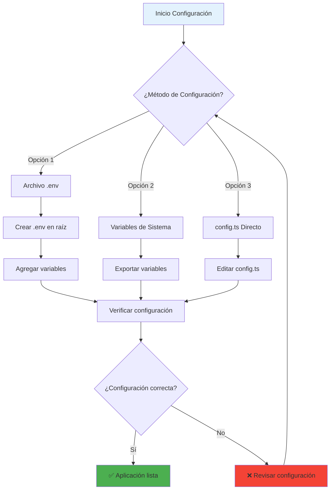

# 🔧 Configuración de Variables de Entorno

## 📋 Variables Requeridas

Para que EduSync funcione correctamente, necesitas configurar las siguientes variables de entorno:

### Flujo de Configuración



### 1. Supabase Configuration

```bash
# URL de tu proyecto Supabase
SUPABASE_URL=https://tu-proyecto.supabase.co

# Clave anónima de Supabase (pública, segura para usar en frontend)
SUPABASE_ANON_KEY=tu_supabase_anon_key_aqui
```

### 2. Groq API Key (Opcional - para el chatbot)

```bash
# Clave API de Groq para el chatbot integrado
GROQ_API_KEY=tu_groq_api_key_aqui
```

## 🚀 Métodos de Configuración

### Opción 1: Archivo .env (Recomendado para desarrollo)

1. Crea un archivo `.env` en la raíz del proyecto (`EduSyncApp/mobile-app/.env`)
2. Agrega las variables:

```bash
SUPABASE_URL=https://tu-proyecto.supabase.co
SUPABASE_ANON_KEY=tu_supabase_anon_key_aqui
GROQ_API_KEY=tu_groq_api_key_aqui
```

### Opción 2: Variables de Entorno del Sistema

#### En Linux/macOS:
```bash
export SUPABASE_URL="https://tu-proyecto.supabase.co"
export SUPABASE_ANON_KEY="tu_supabase_anon_key_aqui"
export GROQ_API_KEY="tu_groq_api_key_aqui"
```

#### En Windows (PowerShell):
```powershell
$env:SUPABASE_URL="https://tu-proyecto.supabase.co"
$env:SUPABASE_ANON_KEY="tu_supabase_anon_key_aqui"
$env:GROQ_API_KEY="tu_groq_api_key_aqui"
```

### Opción 3: Configuración Directa en config.ts

Si prefieres configurar directamente en el código (no recomendado para producción):

1. Edita el archivo `config.ts`
2. Reemplaza los valores:

```typescript
export const SUPABASE_URL = 'https://tu-proyecto.supabase.co';
export const SUPABASE_ANON_KEY = 'tu_supabase_anon_key_aqui';
export const GROQ_API_KEY = 'tu_groq_api_key_aqui';
```

## 🔐 Obtener las Claves

### Supabase

1. Ve a [supabase.com](https://supabase.com)
2. Crea un nuevo proyecto o selecciona uno existente
3. Ve a Settings > API
4. Copia la URL del proyecto y la anon key

### Groq

1. Ve a [console.groq.com](https://console.groq.com)
2. Crea una cuenta o inicia sesión
3. Ve a API Keys
4. Crea una nueva clave API

## ⚠️ Seguridad

### ✅ Lo que SÍ debes hacer:
- Usar variables de entorno en producción
- Mantener las claves privadas seguras
- Rotar las claves regularmente
- Usar diferentes claves para desarrollo y producción

### ❌ Lo que NO debes hacer:
- Committear archivos `.env` al repositorio
- Compartir claves API en código público
- Usar claves de producción en desarrollo
- Hardcodear claves en el código fuente

## 🧪 Verificación

Para verificar que la configuración es correcta:

1. Ejecuta la aplicación: `npm start`
2. Si ves errores de conexión, verifica:
   - Las URLs están correctas
   - Las claves API son válidas
   - No hay espacios extra en las variables

## 🔄 Actualización de Claves

Si necesitas actualizar las claves:

1. Obtén las nuevas claves de los proveedores
2. Actualiza las variables de entorno
3. Reinicia la aplicación
4. Verifica que todo funcione correctamente

## 📞 Soporte

Si tienes problemas con la configuración:

1. Verifica que todas las variables estén configuradas
2. Revisa los logs de la aplicación
3. Confirma que las claves API son válidas
4. Contacta al equipo de desarrollo si persisten los problemas 