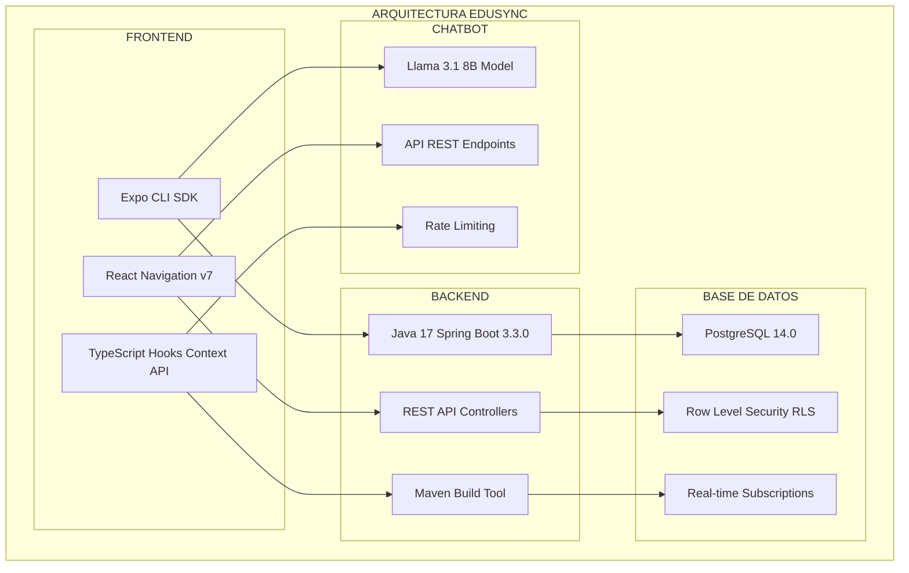
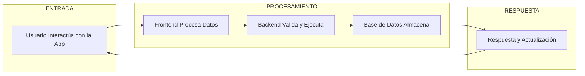
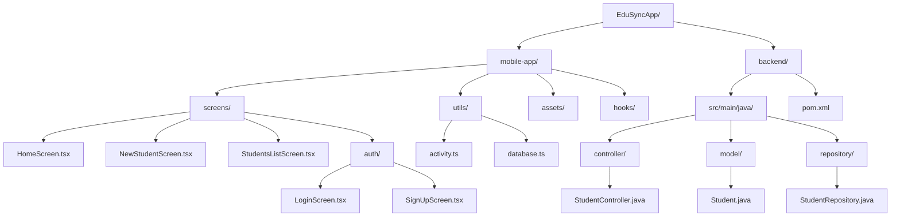

# 🎓 EduSync - Sistema de Gestión Estudiantil

## 📋 Descripción General

**EduSync** es una aplicación móvil completa desarrollada con React Native y Expo que proporciona un sistema integral de gestión estudiantil. La aplicación permite a los administradores educativos gestionar información detallada de estudiantes, generar estadísticas, y mantener un seguimiento de actividades en tiempo real.

## 🏗️ Arquitectura del Sistema

### Arquitectura General



### Flujo de Datos



### **Frontend (Aplicación Móvil)**
- **Framework**: React Native con Expo SDK 52
- **Navegación**: React Navigation v7 con Stack y Tab Navigation
- **Estado**: React Hooks (useState, useEffect, useCallback) y Context API
- **UI/UX**: Componentes nativos con tema personalizado púrpura (#9C27B0)
- **Iconografía**: Expo Vector Icons (Ionicons) con 7,000+ iconos
- **Notificaciones**: Sonner Native para toast notifications con animaciones
- **Animaciones**: React Native Reanimated v3 para transiciones suaves
- **Almacenamiento**: AsyncStorage para persistencia local

### **Backend**
- **Framework**: Spring Boot 3.3.0 con Spring Framework 6
- **Lenguaje**: Java 17 con características modernas (Records, Pattern Matching)
- **Arquitectura**: REST API con controladores anotados (@RestController)
- **Base de Datos**: PostgreSQL 14.0 (a través de Supabase)
- **Dependencias**: Spring Web, Spring JDBC, PostgreSQL Driver, Lombok
- **Build Tool**: Maven 3.8+ con plugins optimizados
- **Logging**: SLF4J con configuración personalizada

### **Base de Datos**
- **Proveedor**: Supabase (PostgreSQL en la nube con AWS)
- **Autenticación**: Supabase Auth con JWT tokens y AsyncStorage
- **Operaciones**: CRUD completo con operaciones personalizadas y optimizadas
- **Seguridad**: Row Level Security (RLS) habilitado con políticas granulares
- **Tiempo Real**: Suscripciones WebSocket para actualizaciones en vivo
- **Backup**: Automático diario con retención de 7 días

## 📱 Funcionalidades Principales

### 1. Gestión de Estudiantes
- **Crear**: Añadir nuevos estudiantes con información completa
- **Leer**: Visualizar lista de estudiantes con búsqueda y filtros
- **Actualizar**: Modificar información de estudiantes existentes
- **Eliminar**: Remover estudiantes del sistema
- **Búsqueda**: Búsqueda por nombre, cédula, facultad o grupo

### 2. Información del Estudiante
Cada estudiante incluye los siguientes campos:
- **Datos Personales**: Nombre, apellido, cédula, edad, fecha de nacimiento, género
- **Información Académica**: Universidad, facultad, materia favorita, año de carrera
- **Detalles Educativos**: Colegio de origen, código de grupo, horario
- **Preferencias**: Herramienta técnica preferida, país de origen

### 3. Estadísticas y Análisis
- **Distribución por Género**: Gráficos de distribución de estudiantes por género
- **Distribución por Facultad**: Análisis de estudiantes por facultad
- **Actividad Reciente**: Seguimiento de acciones realizadas en el sistema
- **Métricas Generales**: Resumen de totales y promedios

### 4. Sistema de Actividades
- **Logging Automático**: Registro automático de todas las operaciones CRUD
- **Historial**: Visualización de actividades recientes
- **Tipos de Actividad**: Creado, actualizado, eliminado

### 5. Chatbot Integrado
- **Proveedor**: Groq API
- **Funcionalidad**: Asistente inteligente para consultas sobre estudiantes
- **Integración**: Acceso directo desde la aplicación

## 🗂️ Estructura del Proyecto



## 🔧 Configuración y Tecnologías

### Dependencias Principales (Frontend)
```json
{
  "@supabase/supabase-js": "2.53.0",      // Cliente de Supabase
  "@react-navigation/native": "7.1.16",   // Navegación
  "@react-navigation/native-stack": "7.3.23",
  "@react-navigation/bottom-tabs": "7.4.4",
  "expo": "^52.0.46",                     // Framework Expo
  "react-native": "0.76.9",               // React Native
  "react-native-gesture-handler": "^2.16.1",
  "react-native-reanimated": "^3.10.1",
  "sonner-native": "0.21.0"               // Notificaciones
}
```

### Dependencias del Backend (Java)
```xml
<dependencies>
  <dependency>
    <groupId>org.springframework.boot</groupId>
    <artifactId>spring-boot-starter-web</artifactId>
  </dependency>
  <dependency>
    <groupId>org.springframework.boot</groupId>
    <artifactId>spring-boot-starter-jdbc</artifactId>
  </dependency>
  <dependency>
    <groupId>org.postgresql</groupId>
    <artifactId>postgresql</artifactId>
  </dependency>
</dependencies>
```

## 🗄️ Base de Datos

### Tabla Principal: `Estudiantes`
```sql
CREATE TABLE Estudiantes (
  id SERIAL PRIMARY KEY,
  nombre VARCHAR(255) NOT NULL,
  apellido VARCHAR(255) NOT NULL,
  cedula VARCHAR(20) UNIQUE NOT NULL,
  edad INTEGER NOT NULL,
  fecha_de_nacimiento DATE NOT NULL,
  genero VARCHAR(10) NOT NULL,
  herramienta_tecnica VARCHAR(255),
  pais_de_origen VARCHAR(100),
  colegio_de_origen VARCHAR(255),
  codigo_de_grupo VARCHAR(50) NOT NULL,
  universidad VARCHAR(255) NOT NULL,
  facultad VARCHAR(255) NOT NULL,
  materia_favorita VARCHAR(255),
  horario VARCHAR(100) NOT NULL,
  año_carrera VARCHAR(20) NOT NULL,
  created_at TIMESTAMP DEFAULT NOW(),
  updated_at TIMESTAMP DEFAULT NOW()
);
```

### Tabla de Actividades: `Actividades`
```sql
CREATE TABLE Actividades (
  id SERIAL PRIMARY KEY,
  tipo VARCHAR(20) NOT NULL, -- 'creado', 'actualizado', 'eliminado'
  descripcion TEXT NOT NULL,
  created_at TIMESTAMP DEFAULT NOW()
);
```

## 🔐 Configuración de Seguridad

### Supabase Configuration
```typescript
export const SUPABASE_URL = 'https://faollalzdyoigzfzggwy.supabase.co';
export const SUPABASE_ANON_KEY = 'eyJhbGciOiJIUzI1NiIsInR5cCI6IkpXVCJ9...';
export const GROQ_API_KEY = ''; // Configurar en variables de entorno
```

**Nota**: Las claves de Supabase están configuradas para desarrollo. La clave de Groq debe configurarse en variables de entorno.

### Características de Seguridad
- **Autenticación**: Supabase Auth con persistencia en AsyncStorage
- **Autorización**: Row Level Security (RLS) en PostgreSQL
- **Validación**: Validación de datos en frontend y backend
- **Logging**: Registro de todas las operaciones para auditoría
- **Variables de Entorno**: Configuración segura de claves API
- **Gitignore**: Protección de archivos sensibles en el repositorio

## 🚀 Instalación y Configuración

### Prerrequisitos
- Node.js 18+ y npm
- Java 17+
- Expo CLI
- Android Studio (para desarrollo Android)
- Xcode (para desarrollo iOS, solo macOS)

### Pasos de Instalación

1. **Clonar el repositorio**
   ```bash
   git clone <repository-url>
   cd EduSyncApp/mobile-app
   ```

2. **Instalar dependencias del frontend**
   ```bash
   npm install
   ```

3. **Configurar variables de entorno**
   - Ver el archivo `SETUP.md` para instrucciones detalladas
   - Crear archivo `.env` con las variables necesarias
   - Configurar `SUPABASE_URL` y `SUPABASE_ANON_KEY`
   - Configurar `GROQ_API_KEY` para el chatbot (opcional)

4. **Configurar el backend**
   ```bash
   cd backend
   mvn clean install
   ```

5. **Ejecutar la aplicación**
   ```bash
   # Frontend
   npm start
   
   # Backend (en otra terminal)
   cd backend
   mvn spring-boot:run
   ```

## 📱 Características de la UI/UX

### Tema Personalizado
- **Colores Principales**: Púrpura (#9C27B0, #4A148C)
- **Fondo**: Negro (#000000)
- **Texto**: Blanco (#ffffff)
- **Bordes**: Gris oscuro (#333333)

### Navegación
- **Stack Navigation**: Navegación entre pantallas principales
- **Bottom Tabs**: Navegación rápida entre secciones
- **Animaciones**: Transiciones suaves y animaciones de entrada

### Componentes Reutilizables
- **Cards**: Para mostrar información de estudiantes
- **Buttons**: Botones personalizados con estados
- **Forms**: Formularios con validación
- **Charts**: Gráficos para estadísticas

## 🔄 Flujo de Datos Detallado

```
┌─────────────────────────────────────────────────────────────────────────────────┐
│                              FLUJO DE DATOS COMPLETO                           │
└─────────────────────────────────────────────────────────────────────────────────┘

┌─────────────────┐    ┌─────────────────┐    ┌─────────────────┐    ┌─────────────────┐
│   USUARIO       │    │   FRONTEND      │    │   SUPABASE      │    │   BACKEND       │
│   INTERFAZ      │    │   REACT NATIVE  │    │   POSTGRESQL    │    │   SPRING BOOT   │
└─────────────────┘    └─────────────────┘    └─────────────────┘    └─────────────────┘
         │                       │                       │                       │
         │ 1. Interacción        │                       │                       │
         │    (Touch, Swipe)     │                       │                       │
         └──────────────────────▶│                       │                       │
                                 │                       │                       │
                                 │ 2. Validación         │                       │
                                 │    Frontend           │                       │
                                 │    (TypeScript)       │                       │
                                 │                       │                       │
                                 │ 3. Operación CRUD     │                       │
                                 │    (Supabase Client)  │                       │
                                 └──────────────────────▶│                       │
                                                         │                       │
                                                         │ 4. Procesamiento      │
                                                         │    SQL + RLS          │
                                                         │                       │
                                                         │ 5. Respuesta          │
                                                         │    (JSON)             │
                                 └──────────────────────▶│                       │
                                                         │                       │
                                                         │ 6. Actualización UI   │
                                                         │    (React State)      │
                                 └──────────────────────▶│                       │
                                                         │                       │
                                                         │ 7. Notificación       │
                                                         │    (Toast)            │
                                 └──────────────────────▶│                       │

┌─────────────────────────────────────────────────────────────────────────────────┐
│                              DETALLE DE OPERACIONES                            │
└─────────────────────────────────────────────────────────────────────────────────┘

┌─────────────────┐    ┌─────────────────┐    ┌─────────────────┐    ┌─────────────────┐
│   CREAR         │    │   LEER          │    │   ACTUALIZAR    │    │   ELIMINAR      │
│   ESTUDIANTE    │    │   ESTUDIANTES   │    │   ESTUDIANTE    │    │   ESTUDIANTE    │
└─────────────────┘    └─────────────────┘    └─────────────────┘    └─────────────────┘
         │                       │                       │                       │
         │ 1. Formulario         │ 1. Pantalla Lista     │ 1. Pantalla Detalle  │ 1. Pantalla Detalle
         │    Validación         │    Carga inicial      │    Edición           │    Confirmación
         │                       │                       │                       │
         │ 2. Supabase Insert    │ 2. Supabase Select    │ 2. Supabase Update   │ 2. Supabase Delete
         │    .insert()          │    .select()          │    .update()         │    .delete()
         │                       │                       │                       │
         │ 3. RLS Policy         │ 3. RLS Policy         │ 3. RLS Policy        │ 3. RLS Policy
         │    Check              │    Check              │    Check             │    Check
         │                       │                       │                       │
         │ 4. PostgreSQL         │ 4. PostgreSQL         │ 4. PostgreSQL        │ 4. PostgreSQL
         │    INSERT INTO        │    SELECT FROM        │    UPDATE SET        │    DELETE FROM
         │                       │                       │                       │
         │ 5. Trigger            │ 5. Result Set         │ 5. Trigger           │ 5. Trigger
         │    Log Activity       │    JSON Response      │    Log Activity      │    Log Activity
         │                       │                       │                       │
         │ 6. Real-time          │ 6. Update UI          │ 6. Real-time         │ 6. Real-time
         │    Subscription       │    State              │    Subscription      │    Subscription
         │                       │                       │                       │
         │ 7. Toast Success      │ 7. Render List        │ 7. Toast Success     │ 7. Toast Success
         │    Notification       │    Components         │    Notification      │    Notification

┌─────────────────────────────────────────────────────────────────────────────────┐
│                              MANEJO DE ERRORES                                 │
└─────────────────────────────────────────────────────────────────────────────────┘

┌─────────────────┐    ┌─────────────────┐    ┌─────────────────┐    ┌─────────────────┐
│   ERROR         │    │   FRONTEND      │    │   BACKEND       │    │   BASE DE       │
│   TYPES         │    │   HANDLING      │    │   HANDLING      │    │   DATOS         │
└─────────────────┘    └─────────────────┘    └─────────────────┘    └─────────────────┘
         │                       │                       │                       │
         │ • Network Error       │ • Try-Catch Blocks    │ • Exception Handler  │ • Constraint Error
         │ • Validation Error    │ • Error Boundaries    │ • Global Exception   │ • Foreign Key Error
         │ • Authentication      │ • Toast Notifications │ • Logging            │ • Unique Constraint
         │ • Authorization       │ • Retry Logic         │ • HTTP Status Codes  │ • Check Constraint
         │ • Database Error      │ • Fallback UI         │ • Error Response     │ • Not Null Error
         │ • API Rate Limit      │ • Loading States      │ • Circuit Breaker    │ • Data Type Error
```

### **Frontend → Backend (Directo a Supabase)**
1. **Operaciones CRUD**: Las operaciones se realizan directamente a Supabase usando el cliente JavaScript
2. **Validación**: Validación en frontend con TypeScript y validación de esquemas
3. **Manejo de Errores**: Toast notifications con Sonner Native para errores específicos
4. **Caché**: AsyncStorage para persistencia de sesión y datos offline
5. **Optimistic Updates**: Actualizaciones optimistas para mejor UX
6. **Retry Logic**: Lógica de reintento automático para operaciones fallidas

### **Backend → Base de Datos (JDBC)**
1. **JDBC Template**: Conexión directa a PostgreSQL usando Spring JDBC
2. **Queries Optimizadas**: Consultas SQL optimizadas con índices apropiados
3. **Transacciones**: Manejo de transacciones ACID para operaciones críticas
4. **Logging**: Registro detallado de todas las operaciones con SLF4J
5. **Connection Pooling**: Pool de conexiones para mejor rendimiento
6. **Prepared Statements**: Uso de prepared statements para seguridad

## 📊 Funcionalidades Avanzadas

### Sistema de Búsqueda
- Búsqueda por nombre (nombre y apellido)
- Filtros por facultad y grupo
- Búsqueda por cédula (búsqueda exacta)

### Estadísticas en Tiempo Real
- Conteo de estudiantes por género
- Distribución por facultad
- Gráficos interactivos
- Exportación de datos

### Sistema de Actividades
- Logging automático de todas las operaciones
- Historial de actividades recientes
- Filtros por tipo de actividad
- Timestamps precisos

## 🛠️ Desarrollo y Mantenimiento

### Scripts Disponibles
```json
{
  "start": "npx expo start",
  "android": "npx expo run:android",
  "ios": "npx expo run:ios",
  "web": "npx expo start --web"
}
```

### Estructura de Código
- **TypeScript**: Tipado estático para mejor mantenibilidad
- **ESLint**: Linting para consistencia de código
- **Prettier**: Formateo automático de código
- **Git Hooks**: Validaciones antes de commit

### Testing
- **Unit Tests**: Tests para utilidades y hooks
- **Integration Tests**: Tests para operaciones de base de datos
- **E2E Tests**: Tests de flujos completos

## 🔮 Roadmap y Mejoras Futuras

### Funcionalidades Planificadas
- [ ] Sistema de notificaciones push
- [ ] Exportación a PDF/Excel
- [ ] Dashboard avanzado con más métricas
- [ ] Integración con sistemas académicos externos
- [ ] Modo offline con sincronización
- [ ] Multiidioma (español/inglés)

### Mejoras Técnicas
- [ ] Migración a React Query para mejor gestión de estado
- [ ] Implementación de PWA
- [ ] Optimización de rendimiento
- [ ] Mejoras en la accesibilidad
- [ ] Tests automatizados completos

## 📚 Documentación

Para información detallada sobre cada componente del proyecto, consulta la documentación específica en la carpeta `docs/`:

- **[📋 Índice de Documentación](docs/README.md)** - Guía completa de toda la documentación disponible
- **[🏗️ Estructura del Proyecto](docs/PROJECT_STRUCTURE.md)** - Organización de carpetas y archivos
- **[🎨 Frontend](docs/FRONTEND_README.md)** - Documentación completa de React Native y Expo
- **[⚙️ Backend](docs/BACKEND_README.md)** - Configuración y desarrollo del servidor Spring Boot
- **[🗄️ Base de Datos](docs/DATABASE_README.md)** - Estructura y operaciones de Supabase
- **[🚀 Despliegue](docs/HOSTING_README.md)** - Guía completa de hosting y producción
- **[📝 Changelog](docs/CHANGELOG.md)** - Registro de cambios y actualizaciones

### 🛠️ Configuración Inicial
Para comenzar con el desarrollo, sigue las instrucciones en **[SETUP.md](EduSyncApp/mobile-app/SETUP.md)**.

## 📞 Soporte y Contacto

Para soporte técnico o consultas sobre el proyecto:
- **Email**: [tu-email@ejemplo.com]
- **GitHub Issues**: [link-al-repositorio/issues]
- **Documentación**: [link-a-documentación]

## 📄 Licencia

Este proyecto está bajo la licencia MIT. Ver el archivo `LICENSE` para más detalles.

---

**Desarrollado con ❤️ para la gestión educativa moderna**