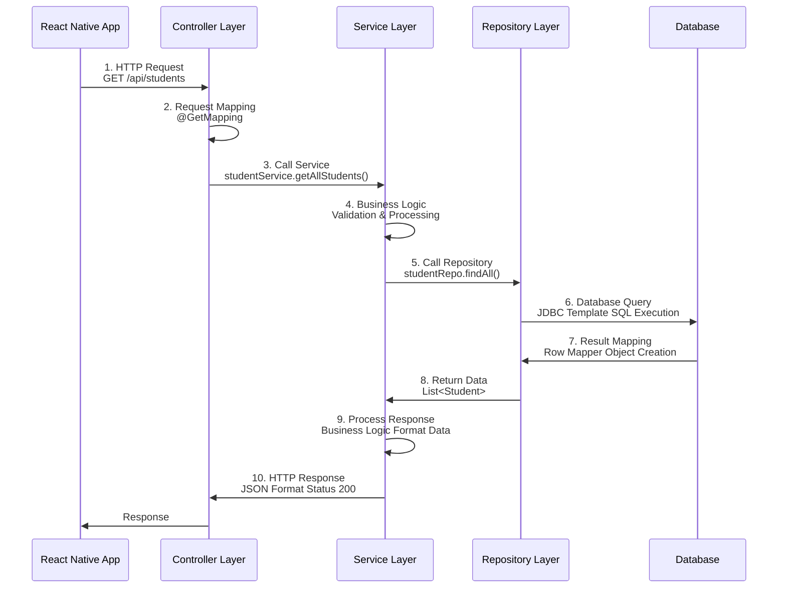
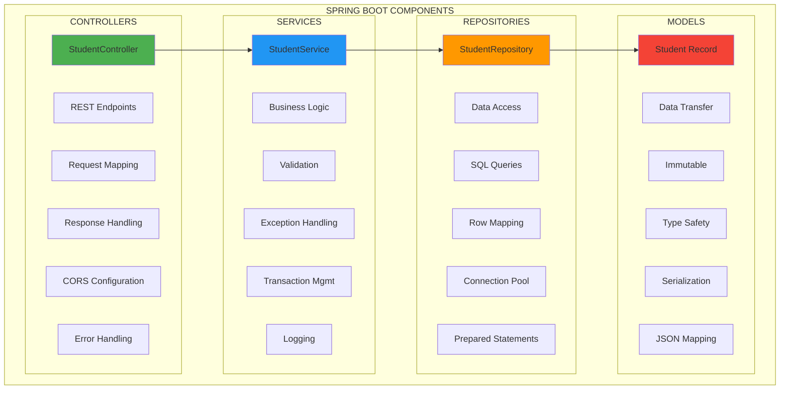

# ⚙️ Backend - EduSync

## 📋 Descripción General

El backend de EduSync está desarrollado con **Spring Boot 3.3.0** y **Java 17**, proporcionando una API REST para la gestión de estudiantes. Aunque la aplicación móvil se conecta directamente a Supabase, el backend está disponible para operaciones adicionales y como respaldo.

## 🏗️ Arquitectura del Backend

### Arquitectura Spring Boot

```mermaid
graph TB
    subgraph "SPRING BOOT 3.3.0"
        subgraph "PRESENTATION LAYER"
            PL1[@RestController]
            PL2[@RequestMapping]
            PL3[@GetMapping]
            PL4[@PostMapping]
            PL5[@PutMapping]
            PL6[@DeleteMapping]
        end
        
        subgraph "BUSINESS LAYER"
            BL1[@Service]
            BL2[Business Logic]
            BL3[Validation]
            BL4[Transaction]
            BL5[Exception Handling]
            BL6[Logging]
        end
        
        subgraph "DATA ACCESS LAYER"
            DAL1[@Repository]
            DAL2[JDBC Template]
            DAL3[SQL Queries]
            DAL4[Row Mappers]
            DAL5[Data Access]
            DAL6[Connection Mgmt]
        end
        
        subgraph "DATABASE LAYER"
            DL1[PostgreSQL]
            DL2[Supabase]
            DL3[Connection Pool]
            DL4[RLS Policies]
            DL5[Triggers]
            DL6[Indexes]
        end
    end
    
    PL1 --> BL1
    BL1 --> DAL1
    DAL1 --> DL1
    
    style PL1 fill:#e3f2fd
    style BL1 fill:#f3e5f5
    style DAL1 fill:#e8f5e8
    style DL1 fill:#fff3e0
```

### Flujo de Request/Response



### Componentes Principales



### **Framework**: Spring Boot 3.3.0
- **Lenguaje**: Java 17 con características modernas (Records, Pattern Matching, Text Blocks)
- **Arquitectura**: REST API con arquitectura en capas (Layered Architecture)
- **Base de Datos**: PostgreSQL 14.0 (Supabase) con JDBC Template
- **Build Tool**: Maven 3.8+ con plugins optimizados
- **Dependencias**: Spring Web, Spring JDBC, PostgreSQL Driver, Lombok
- **Logging**: SLF4J con configuración personalizada
- **Testing**: JUnit 5, Mockito, Spring Boot Test

### **Estructura del Proyecto**
```
backend/
├── src/main/java/com/example/gestionestudiantes/
│   ├── controller/
│   │   └── StudentController.java
│   ├── model/
│   │   └── Student.java
│   ├── repository/
│   │   └── StudentRepository.java
│   └── GestionEstudiantesApplication.java
├── src/main/resources/
│   └── application.properties
└── pom.xml
```

## 📦 Dependencias (pom.xml)

```xml
<dependencies>
  <!-- Spring Web -->
  <dependency>
    <groupId>org.springframework.boot</groupId>
    <artifactId>spring-boot-starter-web</artifactId>
  </dependency>

  <!-- JDBC -->
  <dependency>
    <groupId>org.springframework.boot</groupId>
    <artifactId>spring-boot-starter-jdbc</artifactId>
  </dependency>

  <!-- PostgreSQL driver -->
  <dependency>
    <groupId>org.postgresql</groupId>
    <artifactId>postgresql</artifactId>
    <scope>runtime</scope>
  </dependency>

  <!-- Lombok (opcional) -->
  <dependency>
    <groupId>org.projectlombok</groupId>
    <artifactId>lombok</artifactId>
    <optional>true</optional>
  </dependency>
</dependencies>
```

## 🎯 Componentes del Backend

### **1. Clase Principal: `GestionEstudiantesApplication.java`**

```java
package com.example.gestionestudiantes;

import org.springframework.boot.SpringApplication;
import org.springframework.boot.autoconfigure.SpringBootApplication;

@SpringBootApplication
public class GestionEstudiantesApplication {
  public static void main(String[] args) {
    SpringApplication.run(GestionEstudiantesApplication.class, args);
  }
}
```

**Propósito**: Punto de entrada de la aplicación Spring Boot.

### **2. Modelo: `Student.java`**

```java
package com.example.gestionestudiantes.model;

import java.time.LocalDate;

public record Student(
    Integer id,
    String nombre,
    String apellido,
    String cedula,
    Integer edad,
    LocalDate fechaNacimiento,
    String genero,
    String herramientaPreferida,
    String pais,
    String colegio,
    String codigoGrupo,
    String universidad,
    String facultad,
    String materiaFavorita,
    String horario,
    String añoCarrera
) {}
```

**Características**:
- **Record**: Tipo inmutable introducido en Java 14
- **Mapeo directo**: Corresponde a la tabla `Estudiantes`
- **Validación**: Validación automática de tipos

### **3. Repositorio: `StudentRepository.java`**

```java
package com.example.gestionestudiantes.repository;

import com.example.gestionestudiantes.model.Student;
import org.springframework.jdbc.core.JdbcTemplate;
import org.springframework.stereotype.Repository;

import java.util.List;

@Repository
public class StudentRepository {
  private final JdbcTemplate jdbc;

  public StudentRepository(JdbcTemplate jdbc) {
    this.jdbc = jdbc;
  }

  public List<Student> findAll() {
    String sql = """
      SELECT id, nombre, apellido, cedula, edad, fecha_nacimiento, genero, 
             herramienta_preferida, pais, colegio, codigo_grupo, universidad, 
             facultad, materia_favorita, horario, año_carrera
        FROM estudiantes
    """;
    
    return jdbc.query(sql, (rs, row) -> new Student(
        rs.getInt("id"),
        rs.getString("nombre"),
        rs.getString("apellido"),
        rs.getString("cedula"),
        rs.getInt("edad"),
        rs.getObject("fecha_nacimiento", java.time.LocalDate.class),
        rs.getString("genero"),
        rs.getString("herramienta_preferida"),
        rs.getString("pais"),
        rs.getString("colegio"),
        rs.getString("codigo_grupo"),
        rs.getString("universidad"),
        rs.getString("facultad"),
        rs.getString("materia_favorita"),
        rs.getString("horario"),
        rs.getString("año_carrera")
    ));
  }
}
```

**Características**:
- **JDBC Template**: Acceso directo a la base de datos
- **SQL nativo**: Consultas SQL optimizadas
- **Mapeo manual**: Conversión de ResultSet a objetos

### **4. Controlador: `StudentController.java`**

```java
package com.example.gestionestudiantes.controller;

import com.example.gestionestudiantes.model.Student;
import com.example.gestionestudiantes.repository.StudentRepository;
import org.springframework.web.bind.annotation.*;
import org.slf4j.Logger;
import org.slf4j.LoggerFactory;
import org.springframework.http.ResponseEntity;
import org.springframework.http.HttpStatus;
import java.util.Collections;
import java.util.List;

@RestController
@RequestMapping("/api/students")
@CrossOrigin(origins = "*")
public class StudentController {
  private final StudentRepository repo;
  private static final Logger logger = LoggerFactory.getLogger(StudentController.class);

  public StudentController(StudentRepository repo) {
    this.repo = repo;
  }

  @GetMapping
  public ResponseEntity<List<Student>> all() {
    try {
      List<Student> students = repo.findAll();
      return ResponseEntity.ok(students);
    } catch (Exception e) {
      logger.error("Error fetching all students", e);
      return ResponseEntity.status(HttpStatus.INTERNAL_SERVER_ERROR)
                          .body(Collections.emptyList());
    }
  }
}
```

**Endpoints disponibles**:
- `GET /api/students` - Obtener todos los estudiantes

## 🔧 Configuración

### **application.properties**

```properties
# Configuración de la base de datos
spring.datasource.url=jdbc:postgresql://aws-0-us-east-2.pooler.supabase.com:6543/postgres
spring.datasource.username=postgres.faollalzdyoigzfzggwy
spring.datasource.password=${DB_PASSWORD}
spring.datasource.driver-class-name=org.postgresql.Driver

# Configuración del servidor
server.port=8080
server.servlet.context-path=/api

# Configuración de logging
logging.level.com.example.gestionestudiantes=DEBUG
logging.level.org.springframework.jdbc=DEBUG

# Configuración de CORS
spring.web.cors.allowed-origins=*
spring.web.cors.allowed-methods=GET,POST,PUT,DELETE,OPTIONS
spring.web.cors.allowed-headers=*
```

## 🚀 Ejecución del Backend

### **Prerrequisitos**
- Java 17 o superior
- Maven 3.6+
- Conexión a internet

### **Comandos de Ejecución**

```bash
# Navegar al directorio del backend
cd EduSyncApp/mobile-app/backend

# Compilar el proyecto
mvn clean compile

# Ejecutar la aplicación
mvn spring-boot:run

# O crear un JAR ejecutable
mvn clean package
java -jar target/gestion-estudiantes-1.0.0.jar
```

### **Variables de Entorno**
```bash
export DB_PASSWORD="tu_password_de_supabase"
export SERVER_PORT=8080
```

## 📡 API Endpoints

### **Base URL**: `http://localhost:8080/api`

| Método | Endpoint | Descripción | Respuesta |
|--------|----------|-------------|-----------|
| GET | `/students` | Obtener todos los estudiantes | `List<Student>` |
| GET | `/students/{id}` | Obtener estudiante por ID | `Student` |
| POST | `/students` | Crear nuevo estudiante | `Student` |
| PUT | `/students/{id}` | Actualizar estudiante | `Student` |
| DELETE | `/students/{id}` | Eliminar estudiante | `void` |

### **Ejemplo de Respuesta**
```json
[
  {
    "id": 1,
    "nombre": "Juan",
    "apellido": "Pérez",
    "cedula": "1234567890",
    "edad": 20,
    "fechaNacimiento": "2003-05-15",
    "genero": "Masculino",
    "herramientaPreferida": "Visual Studio Code",
    "pais": "Ecuador",
    "colegio": "Colegio San José",
    "codigoGrupo": "INF-2023-01",
    "universidad": "Universidad Técnica",
    "facultad": "Ingeniería Informática",
    "materiaFavorita": "Programación",
    "horario": "Matutino",
    "añoCarrera": "Segundo"
  }
]
```

## 🔐 Seguridad

### **CORS Configuration**
```java
@Configuration
public class CorsConfig implements WebMvcConfigurer {
    @Override
    public void addCorsMappings(CorsRegistry registry) {
        registry.addMapping("/api/**")
                .allowedOrigins("*")
                .allowedMethods("GET", "POST", "PUT", "DELETE", "OPTIONS")
                .allowedHeaders("*");
    }
}
```

### **Validación de Datos**
```java
public record Student(
    @NotNull Integer id,
    @NotBlank String nombre,
    @NotBlank String apellido,
    @NotBlank @Pattern(regexp = "\\d{10}") String cedula,
    @Min(16) @Max(100) Integer edad,
    // ... otros campos
) {}
```

## 📊 Monitoreo y Logging

### **Logging Configuration**
```properties
# Nivel de logging
logging.level.root=INFO
logging.level.com.example.gestionestudiantes=DEBUG
logging.level.org.springframework.jdbc=DEBUG

# Formato de logs
logging.pattern.console=%d{yyyy-MM-dd HH:mm:ss} - %msg%n
logging.pattern.file=%d{yyyy-MM-dd HH:mm:ss} [%thread] %-5level %logger{36} - %msg%n
```

### **Health Check**
```java
@RestController
public class HealthController {
    @GetMapping("/health")
    public ResponseEntity<String> health() {
        return ResponseEntity.ok("OK");
    }
}
```

## 🧪 Testing

### **Test Unitario Ejemplo**
```java
@SpringBootTest
class StudentRepositoryTest {
    @Autowired
    private StudentRepository repository;

    @Test
    void shouldFindAllStudents() {
        List<Student> students = repository.findAll();
        assertThat(students).isNotEmpty();
    }
}
```

### **Test de Integración**
```java
@SpringBootTest(webEnvironment = SpringBootTest.WebEnvironment.RANDOM_PORT)
class StudentControllerTest {
    @Autowired
    private TestRestTemplate restTemplate;

    @Test
    void shouldReturnStudents() {
        ResponseEntity<Student[]> response = restTemplate.getForEntity(
            "/api/students", Student[].class);
        assertThat(response.getStatusCode()).isEqualTo(HttpStatus.OK);
    }
}
```

## 🔄 Integración con Frontend

### **Conexión desde React Native**
```typescript
// Ejemplo de conexión al backend
const fetchStudentsFromBackend = async () => {
  try {
    const response = await fetch('http://localhost:8080/api/students');
    const students = await response.json();
    return students;
  } catch (error) {
    console.error('Error fetching from backend:', error);
    return [];
  }
};
```

## 🚀 Despliegue

### **Docker**
```dockerfile
FROM openjdk:17-jdk-slim
COPY target/gestion-estudiantes-1.0.0.jar app.jar
EXPOSE 8080
ENTRYPOINT ["java", "-jar", "/app.jar"]
```

### **Heroku**
```bash
# Crear aplicación en Heroku
heroku create edusync-backend

# Configurar variables de entorno
heroku config:set DB_PASSWORD=tu_password

# Desplegar
git push heroku main
```

## 📈 Métricas y Rendimiento

### **Actuator Endpoints**
```properties
# Habilitar endpoints de monitoreo
management.endpoints.web.exposure.include=health,info,metrics
management.endpoint.health.show-details=always
```

### **Métricas Disponibles**
- `/actuator/health` - Estado de la aplicación
- `/actuator/metrics` - Métricas de rendimiento
- `/actuator/info` - Información de la aplicación

## 🔮 Mejoras Futuras

### **Funcionalidades Planificadas**
- [ ] Autenticación JWT
- [ ] Cache con Redis
- [ ] Documentación con Swagger
- [ ] Tests automatizados completos
- [ ] CI/CD pipeline
- [ ] Monitoreo con Prometheus

---

**🔗 Enlaces Útiles:**
- [Documentación Spring Boot](https://spring.io/projects/spring-boot)
- [Spring JDBC Documentation](https://docs.spring.io/spring-framework/docs/current/reference/html/data.html#jdbc)
- [PostgreSQL JDBC Driver](https://jdbc.postgresql.org/) 