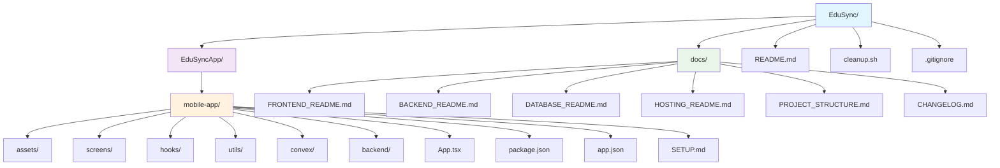

# 📝 Changelog - EduSync

## 🎯 Versión 1.0.0 - Reorganización del Proyecto

### 📅 Fecha: Diciembre 2024

### 🎉 Resumen de Cambios

Esta versión incluye una reorganización completa de la estructura del proyecto para mejorar la claridad, mantenibilidad y escalabilidad del código. Se han realizado cambios significativos en la organización de carpetas y documentación.

### ✅ Cambios Realizados

#### 1. **Renombrado de Carpeta Principal**
- **Antes**: `EduSyncApp/a0-project/`
- **Después**: `EduSyncApp/mobile-app/`
- **Razón**: Nombre más descriptivo que refleja el contenido (aplicación móvil)

#### 2. **Limpieza de Estructura**
- **Eliminadas carpetas vacías**:
  - `backend/` (vacía en el nivel raíz)
  - `frontend/` (vacía en el nivel raíz)
  - `database/` (vacía en el nivel raíz)
- **Resultado**: Estructura más limpia y enfocada

#### 3. **Actualización de Configuración**
- **package.json**: Cambio de nombre de `a0-project` a `mobile-app`
- **app.json**: Actualización del nombre de la aplicación Expo
- **SETUP.md**: Actualización de rutas de configuración

#### 4. **Documentación Actualizada**
- **README.md**: Rutas actualizadas en la estructura del proyecto
- **FRONTEND_README.md**: Referencias actualizadas
- **BACKEND_README.md**: Rutas de configuración actualizadas
- **HOSTING_README.md**: Instrucciones de despliegue actualizadas
- **cleanup.sh**: Script de limpieza actualizado

#### 5. **Reorganización de Documentación**
- **Movidos a carpeta docs/**: Todos los READMEs específicos
- **Mantenido en raíz**: Solo README.md principal
- **Estructura más limpia**: Documentación organizada por categorías
- **Creado docs/README.md**: Índice de documentación para facilitar navegación
- **Actualizado README.md principal**: Agregada sección de documentación con enlaces

#### 6. **Nueva Documentación**
- **PROJECT_STRUCTURE.md**: Documentación completa de la nueva estructura
- **CHANGELOG.md**: Este archivo de cambios

### 📁 Nueva Estructura del Proyecto



### 🎯 Beneficios Obtenidos

1. **Claridad**: Nombres más descriptivos y profesionales
2. **Mantenibilidad**: Estructura más fácil de navegar y entender
3. **Escalabilidad**: Preparado para futuras expansiones del proyecto
4. **Consistencia**: Documentación actualizada y coherente
5. **Limpieza**: Eliminación de elementos innecesarios

### 🚀 Próximos Pasos Recomendados

1. **Verificar funcionalidad**: Asegurar que la aplicación funciona correctamente con la nueva estructura
2. **Actualizar scripts**: Revisar cualquier script personalizado que pueda referenciar las rutas antiguas
3. **Comunicar cambios**: Informar al equipo sobre la nueva estructura
4. **Actualizar CI/CD**: Revisar pipelines de integración continua si existen

### 📋 Comandos de Verificación

```bash
# Verificar que la aplicación funciona
cd EduSyncApp/mobile-app
npm install
npx expo start

# Verificar que no hay referencias a la carpeta antigua
grep -r "a0-project" . --exclude-dir=node_modules --exclude-dir=.git

# Verificar la nueva estructura
find . -type d -maxdepth 3 | grep -v node_modules | grep -v .git
```

---

**Nota**: Todos los cambios han sido realizados manteniendo la funcionalidad existente del proyecto. La aplicación debería funcionar exactamente igual que antes, pero con una estructura más organizada y profesional. 