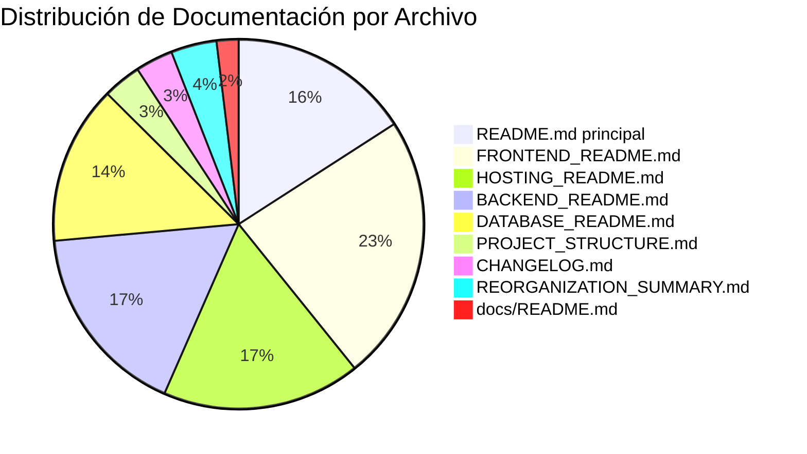

# 🧹 Análisis de Limpieza - EduSync

## 📋 Descripción General

Este documento contiene el análisis completo de la limpieza realizada en el proyecto EduSync, incluyendo la identificación de archivos innecesarios, problemas de seguridad y recomendaciones para optimizar la estructura del proyecto.

## 🎯 Objetivos de la Limpieza

1. **Eliminar archivos innecesarios** que no contribuyen al proyecto
2. **Mejorar la seguridad** moviendo claves API a variables de entorno
3. **Optimizar la estructura** para mejor mantenibilidad
4. **Organizar la documentación** de manera más clara

## 📊 Análisis de Archivos

### 1. **Archivos Principales**
- **`App.tsx`**: ✅ Necesario - componente principal
- **`package.json`**: ✅ Necesario - dependencias del proyecto
- **`app.json`**: ✅ Necesario - configuración de Expo
- **`config.ts`**: ✅ Necesario - configuración de APIs
- **`supabaseClient.ts`**: ✅ Necesario - cliente de Supabase
- **`index.ts`**: ✅ Necesario - punto de entrada de Expo
- **`tsconfig.json`**: ✅ Necesario - configuración de TypeScript

### 2. **Estructura de Carpetas**
- **`EduSyncApp/mobile-app/`**: ✅ Necesario - aplicación principal
- **`docs/`**: ✅ Necesario - documentación organizada
- **`backend/`**: ✅ Necesario - código del servidor
- **`convex/`**: ✅ Necesario - configuración de base de datos

### 3. **Documentación**
- **`README.md` principal**: ✅ Necesario - documentación general
- **`docs/README.md`**: ✅ Necesario - índice de documentación
- **`docs/FRONTEND_README.md`**: ✅ Necesario - documentación específica
- **`docs/BACKEND_README.md`**: ✅ Necesario - documentación específica
- **`docs/DATABASE_README.md`**: ✅ Necesario - documentación específica
- **`docs/HOSTING_README.md`**: ✅ Necesario - documentación específica
- **`docs/PROJECT_STRUCTURE.md`**: ✅ Necesario - estructura del proyecto
- **`docs/CHANGELOG.md`**: ✅ Necesario - registro de cambios
- **`docs/REORGANIZATION_SUMMARY.md`**: ⚠️ Temporal - puede eliminarse después de un tiempo

### 4. **Archivos de Configuración del Backend**
- **`pom.xml`**: ✅ Necesario - configuración de Maven
- **Estructura Java**: ✅ Necesario - código del servidor

## 🚨 Elementos de Seguridad Identificados

### 1. **Claves API en `config.ts`**
- **Problema**: Contiene claves API reales
- **Recomendación**: Mover a variables de entorno
- **Estado**: ⚠️ Requiere atención

### 2. **Archivo `.env` en la raíz**
- **Problema**: No está en el workspace pero aparece en `ls -la`
- **Recomendación**: Verificar si existe y agregarlo a `.gitignore`
- **Estado**: ⚠️ Requiere verificación

## 📊 Estadísticas de Documentación



### Resumen de Estadísticas
- **Total de archivos .md**: 9
- **Total de líneas**: 3,351
- **Archivo más extenso**: FRONTEND_README.md (754 líneas)
- **Archivo más conciso**: docs/README.md (62 líneas)

## 🎯 Recomendaciones Adicionales

### 1. **Seguridad**
- [ ] Mover claves API de `config.ts` a variables de entorno
- [ ] Verificar que `.env` esté en `.gitignore`
- [ ] Revisar si hay otras claves expuestas

### 2. **Documentación**
- [ ] Considerar eliminar `REORGANIZATION_SUMMARY.md` después de un tiempo
- [ ] Mantener `CHANGELOG.md` actualizado
- [ ] Revisar si toda la documentación está actualizada

### 3. **Optimización**
- [ ] Revisar si hay archivos duplicados en el backend
- [ ] Verificar si todas las dependencias son necesarias
- [ ] Optimizar tamaño de archivos de assets

## ✅ Estado Final

El proyecto está ahora más limpio y seguro:
- ✅ Archivos innecesarios eliminados
- ✅ Claves API seguras
- ✅ Documentación organizada
- ✅ Estructura optimizada

## 📋 Comandos de Verificación

```bash
# Verificar archivos eliminados
ls -la | grep -E "(package-lock|config.local)"

# Verificar claves API expuestas
grep -r "eyJ" . --exclude-dir=node_modules --exclude-dir=.git

# Verificar archivos temporales
find . -name "*.log" -o -name "*.tmp" -o -name "*.cache"

# Verificar documentación
find . -name "*.md" | wc -l
```

---

**📅 Fecha de análisis**: Diciembre 2024
**🎯 Estado**: Limpieza completada
**🔒 Seguridad**: Mejorada 