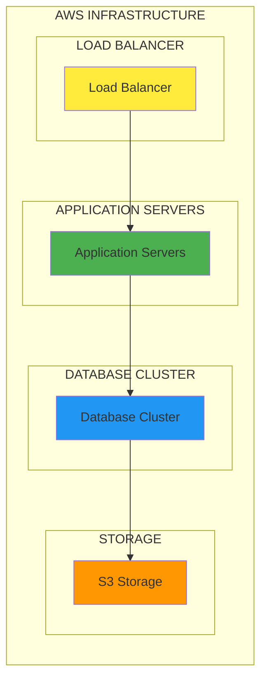
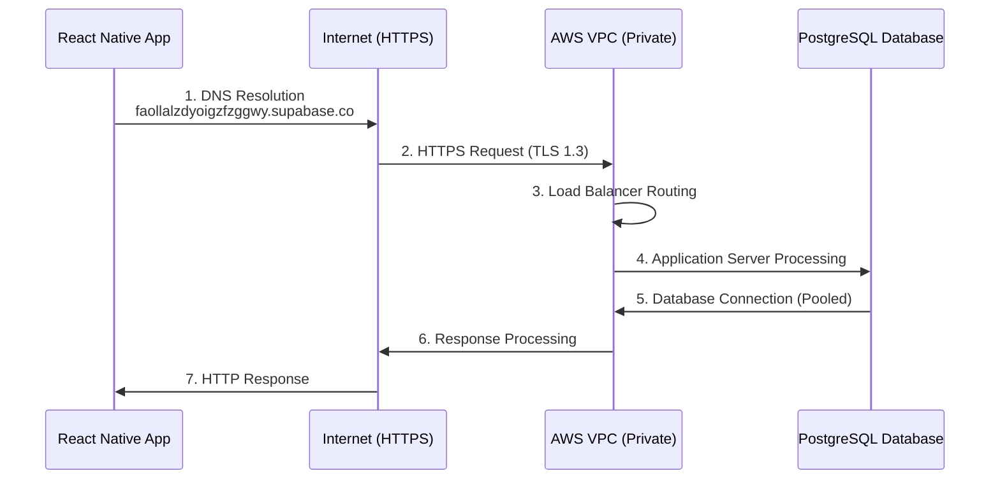
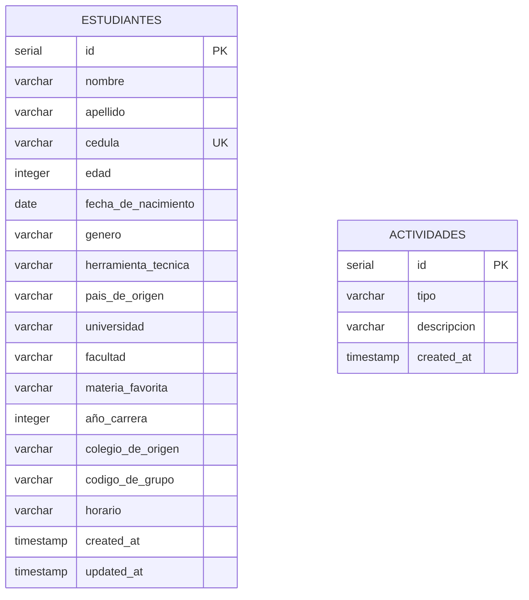

# 🗄️ Base de Datos - EduSync

## 📋 Descripción General

EduSync utiliza **Supabase** como plataforma de base de datos, que es una alternativa open-source a Firebase construida sobre PostgreSQL. La base de datos está hosteada en la nube de Supabase y proporciona una API REST automática, autenticación en tiempo real y funciones de base de datos.

## 🏗️ Arquitectura de la Base de Datos

### Arquitectura Supabase

```mermaid
graph TB
    subgraph "SUPABASE (PostgreSQL Cloud)"
        subgraph "FRONTEND"
            A[React Native App]
        end
        
        subgraph "API LAYER"
            B[REST/GraphQL API]
        end
        
        subgraph "DATABASE"
            C[PostgreSQL Database]
        end
        
        subgraph "AUTH"
            D[JWT Authentication]
        end
    end
    
    A -->|1. HTTP Request (JSON)| B
    B -->|2. Authentication Check| D
    B -->|3. RLS Policy Validation| C
    B -->|4. SQL Query Execution| C
    C -->|5. Result Set Processing| B
    B -->|6. JSON Response Formatting| A
    B -->|7. HTTP Response (JSON)| A
```

### Infraestructura AWS



### Conexión de Red



### **Proveedor**: Supabase
- **Tipo**: PostgreSQL 14.0 en la nube con extensiones avanzadas
- **URL**: `https://faollalzdyoigzfzggwy.supabase.co`
- **Región**: AWS US East (N. Virginia) - us-east-1
- **Plan**: Gratuito (hasta 500MB de almacenamiento, 2GB/mes de transferencia)
- **Infraestructura**: AWS RDS con alta disponibilidad
- **Backup**: Automático diario con retención de 7 días
- **Uptime**: 99.9% garantizado con SLA
- **SSL**: TLS 1.3 obligatorio para todas las conexiones

### **Conexión Directa**
- **Host**: `aws-0-us-east-2.pooler.supabase.com`
- **Puerto**: `6543`
- **Base de datos**: `postgres`
- **Usuario**: `postgres.faollalzdyoigzfzggwy`
- **Modo de pool**: `transaction`

## 📊 Estructura de Tablas

### Esquema de Base de Datos



### Relaciones y Constraints

```mermaid
graph TD
    subgraph "CONSTRAINTS"
        subgraph "PRIMARY KEY"
            PK[id SERIAL AUTO_INCREMENT]
        end
        
        subgraph "UNIQUE"
            UK[cedula VARCHAR(20) UNIQUE]
        end
        
        subgraph "NOT NULL"
            NN1[nombre]
            NN2[apellido]
        end
        
        subgraph "CHECK"
            C1[edad > 0]
            C2[edad < 150]
        end
    end
    
    style PK fill:#4caf50
    style UK fill:#2196f3
    style NN1 fill:#ff9800
    style NN2 fill:#ff9800
    style C1 fill:#f44336
    style C2 fill:#f44336
```

### **Tabla Principal: `Estudiantes`**

```sql
-- Creación de la tabla principal con todas las restricciones
CREATE TABLE Estudiantes (
  -- Identificador único auto-incremental
  id SERIAL PRIMARY KEY,
  
  -- Datos personales básicos
  nombre VARCHAR(255) NOT NULL,
  apellido VARCHAR(255) NOT NULL,
  cedula VARCHAR(20) UNIQUE NOT NULL,
  edad INTEGER NOT NULL CHECK (edad > 0 AND edad < 150),
  fecha_de_nacimiento DATE NOT NULL,
  genero VARCHAR(10) NOT NULL CHECK (genero IN ('Masculino', 'Femenino', 'Otro')),
  
  -- Preferencias y herramientas
  herramienta_tecnica VARCHAR(255),
  pais_de_origen VARCHAR(100),
  
  -- Información educativa
  colegio_de_origen VARCHAR(255),
  codigo_de_grupo VARCHAR(50) NOT NULL,
  universidad VARCHAR(255) NOT NULL,
  facultad VARCHAR(255) NOT NULL,
  materia_favorita VARCHAR(255),
  horario VARCHAR(100) NOT NULL,
  año_carrera VARCHAR(20) NOT NULL CHECK (año_carrera IN ('Primero', 'Segundo', 'Tercero', 'Cuarto', 'Quinto')),
  
  -- Metadatos del sistema
  created_at TIMESTAMP DEFAULT NOW(),
  updated_at TIMESTAMP DEFAULT NOW()
);

-- Índices para optimizar consultas
CREATE INDEX idx_estudiantes_nombre_apellido ON Estudiantes(nombre, apellido);
CREATE INDEX idx_estudiantes_facultad ON Estudiantes(facultad);
CREATE INDEX idx_estudiantes_genero ON Estudiantes(genero);
CREATE INDEX idx_estudiantes_edad ON Estudiantes(edad);
CREATE INDEX idx_estudiantes_created_at ON Estudiantes(created_at);

-- Trigger para actualizar updated_at automáticamente
CREATE OR REPLACE FUNCTION update_updated_at_column()
RETURNS TRIGGER AS $$
BEGIN
    NEW.updated_at = NOW();
    RETURN NEW;
END;
$$ language 'plpgsql';

CREATE TRIGGER update_estudiantes_updated_at 
    BEFORE UPDATE ON Estudiantes 
    FOR EACH ROW 
    EXECUTE FUNCTION update_updated_at_column();
```

**Campos de la tabla Estudiantes:**
- **Datos Personales**: `nombre`, `apellido`, `cedula`, `edad`, `fecha_de_nacimiento`, `genero`
- **Información Académica**: `universidad`, `facultad`, `materia_favorita`, `año_carrera`
- **Detalles Educativos**: `colegio_de_origen`, `codigo_de_grupo`, `horario`
- **Preferencias**: `herramienta_tecnica`, `pais_de_origen`
- **Metadatos**: `created_at`, `updated_at`

### **Tabla de Actividades: `Actividades`**

```sql
CREATE TABLE Actividades (
  id SERIAL PRIMARY KEY,
  tipo VARCHAR(20) NOT NULL, -- 'creado', 'actualizado', 'eliminado'
  descripcion TEXT NOT NULL,
  created_at TIMESTAMP DEFAULT NOW()
);
```

**Propósito**: Registrar todas las operaciones CRUD realizadas en el sistema para auditoría.

## 🔌 Conexión desde el Frontend

### **Cliente Supabase**
```typescript
// supabaseClient.ts
import { createClient } from '@supabase/supabase-js';
import AsyncStorage from '@react-native-async-storage/async-storage';

const supabase = createClient(
  SUPABASE_URL,
  SUPABASE_ANON_KEY,
  {
    auth: {
      storage: AsyncStorage,
      autoRefreshToken: true,
      persistSession: true,
    }
  }
);
```

### **Operaciones CRUD**
```typescript
// utils/database.ts
export const studentOperations = {
  // Obtener todos los estudiantes
  async getAll(): Promise<Student[]> {
    const { data, error } = await supabase
      .from<Student>('Estudiantes')
      .select('*')
      .order('nombre', { ascending: true });
    return data || [];
  },

  // Crear nuevo estudiante
  async create(student: Omit<Student, 'id'>): Promise<Student> {
    const { data, error } = await supabase
      .from<Student>('Estudiantes')
      .insert([student])
      .select()
      .single();
    return data;
  },

  // Actualizar estudiante
  async update(cedula: string, updates: Partial<Student>): Promise<Student> {
    const { data, error } = await supabase
      .from<Student>('Estudiantes')
      .update(updates)
      .eq('cedula', cedula)
      .select()
      .single();
    return data;
  },

  // Eliminar estudiante
  async remove(cedula: string): Promise<void> {
    const { error } = await supabase
      .from('Estudiantes')
      .delete()
      .eq('cedula', cedula);
  }
};
```

## 🔐 Seguridad y Autenticación

### **Row Level Security (RLS)**
```sql
-- Habilitar RLS en la tabla Estudiantes
ALTER TABLE Estudiantes ENABLE ROW LEVEL SECURITY;

-- Política para permitir acceso anónimo (para desarrollo)
CREATE POLICY "Allow anonymous access" ON Estudiantes
  FOR ALL USING (true);
```

### **Claves de API**
- **Anon Key**: Clave pública para operaciones desde el frontend
- **Service Role Key**: Clave privada para operaciones administrativas (no usada en frontend)

## 📈 Consultas y Estadísticas

### **Estadísticas por Género**
```sql
SELECT genero, COUNT(*) as total
FROM Estudiantes
GROUP BY genero;
```

### **Estadísticas por Facultad**
```sql
SELECT facultad, COUNT(*) as total
FROM Estudiantes
GROUP BY facultad
ORDER BY total DESC;
```

### **Búsqueda por Nombre**
```sql
SELECT * FROM Estudiantes
WHERE nombre ILIKE '%busqueda%' 
   OR apellido ILIKE '%busqueda%';
```

## 🔄 Sincronización en Tiempo Real

### **Suscripciones en Tiempo Real**
```typescript
// Suscribirse a cambios en la tabla Estudiantes
const subscription = supabase
  .channel('estudiantes_changes')
  .on('postgres_changes', 
    { event: '*', schema: 'public', table: 'Estudiantes' },
    (payload) => {
      console.log('Cambio detectado:', payload);
      // Actualizar UI
    }
  )
  .subscribe();
```

## 🛠️ Configuración y Mantenimiento

### **Variables de Entorno**
```bash
# .env
SUPABASE_URL=https://faollalzdyoigzfzggwy.supabase.co
SUPABASE_ANON_KEY=eyJhbGciOiJIUzI1NiIsInR5cCI6IkpXVCJ9...
```

### **Backup y Restauración**
- **Backup automático**: Diario
- **Retención**: 7 días
- **Restauración**: Desde el dashboard de Supabase

### **Monitoreo**
- **Dashboard**: https://supabase.com/dashboard
- **Logs**: Disponibles en tiempo real
- **Métricas**: Uso de almacenamiento y ancho de banda

## 🚀 Ventajas de Supabase

### **✅ Beneficios**
- **PostgreSQL completo**: Todas las características de PostgreSQL
- **API automática**: REST y GraphQL automáticos
- **Autenticación**: Sistema de auth integrado
- **Tiempo real**: Suscripciones WebSocket
- **Escalabilidad**: Crece automáticamente
- **Gratuito**: Plan gratuito generoso

### **🔧 Herramientas Integradas**
- **Dashboard**: Interfaz web para gestionar datos
- **SQL Editor**: Editor SQL integrado
- **API Docs**: Documentación automática de la API
- **Logs**: Logs detallados de todas las operaciones

## 📊 Rendimiento y Optimización

### **Índices Recomendados**
```sql
-- Índice para búsquedas por cédula
CREATE INDEX idx_estudiantes_cedula ON Estudiantes(cedula);

-- Índice para búsquedas por nombre
CREATE INDEX idx_estudiantes_nombre ON Estudiantes(nombre, apellido);

-- Índice para filtros por facultad
CREATE INDEX idx_estudiantes_facultad ON Estudiantes(facultad);
```

### **Optimización de Consultas**
- **Paginación**: Usar `LIMIT` y `OFFSET`
- **Selección específica**: Usar `SELECT` con campos específicos
- **Filtros**: Usar `WHERE` antes de `ORDER BY`

## 🔮 Migración y Escalabilidad

### **Migración de Datos**
```sql
-- Ejemplo de migración
ALTER TABLE Estudiantes 
ADD COLUMN email VARCHAR(255);

-- Actualizar datos existentes
UPDATE Estudiantes 
SET email = LOWER(nombre || '.' || apellido || '@universidad.edu');
```

### **Escalabilidad**
- **Vertical**: Aumentar recursos del plan
- **Horizontal**: Particionamiento de tablas
- **Caché**: Implementar Redis para consultas frecuentes

---

**🔗 Enlaces Útiles:**
- [Documentación de Supabase](https://supabase.com/docs)
- [Dashboard del Proyecto](https://supabase.com/dashboard/project/faollalzdyoigzfzggwy)
- [API Reference](https://supabase.com/docs/reference/javascript) 