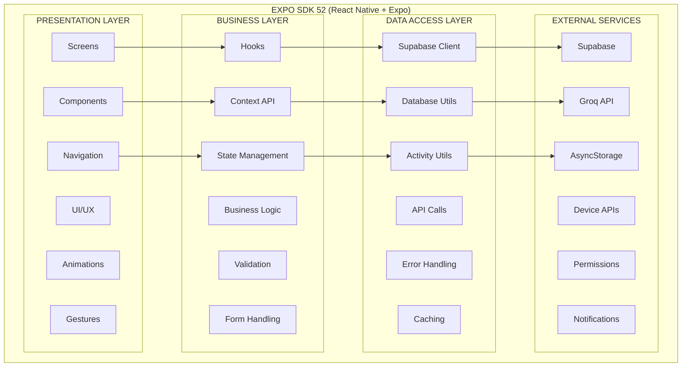
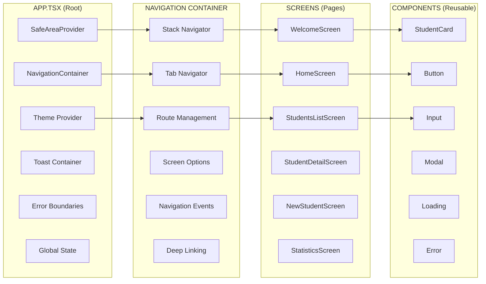
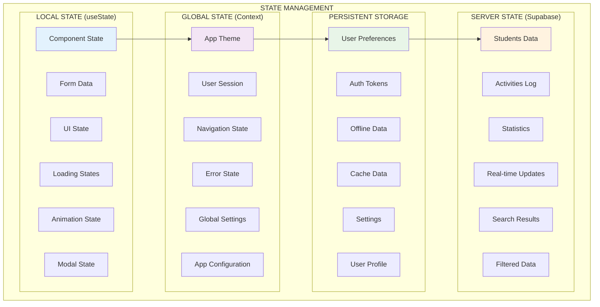
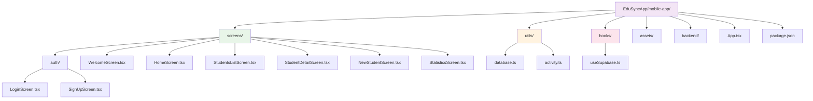

# 📱 Frontend - EduSync

## 📋 Descripción General

El frontend de EduSync es una aplicación móvil desarrollada con **React Native** y **Expo**, diseñada para proporcionar una experiencia de usuario moderna e intuitiva en la gestión de estudiantes. La aplicación utiliza un tema personalizado púrpura y ofrece funcionalidades completas de CRUD.

## 🏗️ Arquitectura del Frontend

### Arquitectura React Native



### Flujo de Componentes



### Ciclo de Vida de Componentes

```mermaid
flowchart TD
    subgraph "MOUNTING PHASE"
        M1[constructor()]
        M2[render()]
        M3[componentDidMount]
        M4[useEffect(()=>{},[])]
        M5[useState()]
        M6[Context Provider]
    end
    
    subgraph "UPDATING PHASE"
        U1[shouldComponentUpdate]
        U2[componentWillUpdate]
        U3[render()]
        U4[componentDidUpdate]
        U5[useEffect()]
        U6[useCallback()]
    end
    
    subgraph "UNMOUNTING PHASE"
        UM1[componentWillUnmount]
        UM2[cleanup()]
        UM3[cancel subscriptions]
        UM4[clear timers]
        UM5[remove listeners]
        UM6[memory cleanup]
    end
    
    subgraph "ERROR HANDLING"
        E1[componentDidCatch]
        E2[Error Boundary]
        E3[Fallback UI]
        E4[Error Logging]
        E5[User Notification]
        E6[Retry Logic]
    end
    
    M1 --> M2 --> M3 --> M4 --> M5 --> M6
    M6 --> U1 --> U2 --> U3 --> U4 --> U5 --> U6
    U6 --> UM1 --> UM2 --> UM3 --> UM4 --> UM5 --> UM6
    M6 --> E1 --> E2 --> E3 --> E4 --> E5 --> E6
```

### Estado y Gestión de Datos



### **Framework**: React Native con Expo SDK 52
- **Lenguaje**: TypeScript 5.1+ con tipado estricto
- **Navegación**: React Navigation v7 con Stack y Tab Navigation
- **Estado**: React Hooks (useState, useEffect, useCallback, useMemo) y Context API
- **UI/UX**: Componentes nativos con tema personalizado púrpura (#9C27B0)
- **Base de Datos**: Supabase (conexión directa) con cliente JavaScript optimizado
- **Animaciones**: React Native Reanimated v3 para transiciones suaves
- **Almacenamiento**: AsyncStorage para persistencia local y offline
- **Notificaciones**: Sonner Native para toast notifications con animaciones

### **Estructura del Proyecto**



## 📦 Dependencias Principales

### **Navegación**
```json
{
  "@react-navigation/native": "7.1.16",
  "@react-navigation/native-stack": "7.3.23",
  "@react-navigation/bottom-tabs": "7.4.4",
  "react-native-screens": "4.11.1",
  "react-native-safe-area-context": "^4.10.5"
}
```

### **Base de Datos y Autenticación**
```json
{
  "@supabase/supabase-js": "2.53.0",
  "@react-native-async-storage/async-storage": "latest"
}
```

### **UI y Componentes**
```json
{
  "@expo/vector-icons": "latest",
  "expo-linear-gradient": "14.1.5",
  "react-native-svg": "15.12.0",
  "sonner-native": "0.21.0"
}
```

### **Utilidades**
```json
{
  "expo-camera": "16.1.11",
  "expo-image-picker": "16.1.4",
  "expo-document-picker": "13.1.6",
  "expo-print": "14.1.4"
}
```

## 🎯 Componentes Principales

### **1. App.tsx - Componente Principal**

```typescript
import { NavigationContainer, DarkTheme } from '@react-navigation/native';
import { createNativeStackNavigator } from '@react-navigation/native-stack';

// Tema personalizado con colores púrpura
const CustomDarkTheme = {
  ...DarkTheme,
  colors: {
    ...DarkTheme.colors,
    primary: '#9C27B0',
    background: '#000000',
    card: '#4A148C',
    text: '#ffffff',
    border: '#333333',
    notification: '#9C27B0',
  },
};

const Stack = createNativeStackNavigator<RootStackParamList>();

export default function App() {
  const [dbError, setDbError] = useState<string | null>(null);
  const [checkingDb, setCheckingDb] = useState(true);

  useEffect(() => {
    // Verificar conexión a Supabase
    supabase
      .from('Estudiantes')
      .select('cedula')
      .limit(1)
      .then(({ error }) => {
        if (error) {
          setDbError(error.message);
        }
      })
      .finally(() => setCheckingDb(false));
  }, []);

  return (
    <SafeAreaProvider style={styles.container}>
      <Toaster />
      {checkingDb ? (
        <LoadingScreen />
      ) : dbError ? (
        <ErrorScreen error={dbError} />
      ) : (
        <NavigationContainer theme={CustomDarkTheme}>
          <Stack.Navigator screenOptions={{ headerShown: false }}>
            <Stack.Screen name="Welcome" component={WelcomeScreen} />
            <Stack.Screen name="Home" component={HomeScreen} />
            {/* ... otras pantallas */}
          </Stack.Navigator>
        </NavigationContainer>
      )}
    </SafeAreaProvider>
  );
}
```

### **2. WelcomeScreen.tsx - Pantalla de Bienvenida**

```typescript
export default function WelcomeScreen() {
  const navigation = useNavigation<WelcomeScreenNavigationProp>();
  const fadeAnim = React.useRef(new Animated.Value(0)).current;
  const moveAnim = React.useRef(new Animated.Value(50)).current;

  useEffect(() => {
    // Animación de entrada
    Animated.sequence([
      Animated.parallel([
        Animated.timing(fadeAnim, {
          toValue: 1,
          duration: 1000,
          useNativeDriver: true,
        }),
        Animated.timing(moveAnim, {
          toValue: 0,
          duration: 1000,
          useNativeDriver: true,
        }),
      ]),
    ]).start();
  }, []);

  return (
    <SafeAreaView style={styles.container}>
      <Animated.View style={[styles.header, { opacity: fadeAnim, transform: [{ translateY: moveAnim }] }]}>
        <Image source={{ uri: 'https://api.a0.dev/assets/image?text=graduation%20cap%20with%20students%20modern%20purple&aspect=1:1' }} style={styles.logo} />
        <Text style={styles.title}>Sistema de Gestión</Text>
        <Text style={styles.subtitle}>Estudiantil</Text>
      </Animated.View>
      
      <TouchableOpacity style={styles.startButton} onPress={() => navigation.navigate('Home')}>
        <Text style={styles.startButtonText}>Comenzar</Text>
      </TouchableOpacity>
    </SafeAreaView>
  );
}
```

### **3. HomeScreen.tsx - Pantalla Principal**

```typescript
export default function HomeScreen() {
  const navigation = useNavigation<HomeScreenNavigationProp>();
  const [students, setStudents] = useState<Student[]>([]);
  const [loading, setLoading] = useState(true);
  const [activities, setActivities] = useState<Activity[]>([]);

  const fetchStudents = useCallback(async () => {
    try {
      const { data, error } = await supabase
        .from<Student>('Estudiantes')
        .select('*');
      if (error) throw error;
      setStudents(data ?? []);
    } catch (error) {
      console.error("Error al obtener estudiantes", error);
      toast.error("Error al cargar datos");
    } finally {
      setLoading(false);
    }
  }, []);

  useEffect(() => {
    fetchStudents();
    activityOperations.fetchRecent().then(setActivities);
  }, [fetchStudents]);

  return (
    <SafeAreaView style={styles.container}>
      <ScrollView 
        style={styles.scrollView}
        refreshControl={
          <RefreshControl refreshing={loading} onRefresh={fetchStudents} />
        }
      >
        {renderHeader()}
        {renderSummaryCards()}
        {renderQuickActions()}
        {renderRecentActivity()}
      </ScrollView>
    </SafeAreaView>
  );
}
```

## 🔌 Conexión con Base de Datos

### **Cliente Supabase**
```typescript
// supabaseClient.ts
import { createClient } from '@supabase/supabase-js';
import AsyncStorage from '@react-native-async-storage/async-storage';

const supabase = createClient(
  SUPABASE_URL,
  SUPABASE_ANON_KEY,
  {
    auth: {
      storage: AsyncStorage,
      autoRefreshToken: true,
      persistSession: true,
      detectSessionInUrl: false,
    },
    global: {
      fetch: globalThis.fetch,
      WebSocket: globalThis.WebSocket,
    },
  }
);
```

### **Operaciones de Base de Datos**
```typescript
// utils/database.ts
export const studentOperations = {
  async getAll(): Promise<Student[]> {
    const { data, error } = await supabase
      .from<Student>('Estudiantes')
      .select('*')
      .order('nombre', { ascending: true });

    if (error) {
      console.error('[studentOperations] getAll error:', error);
      throw error;
    }
    return data || [];
  },

  async create(student: Omit<Student, 'id'>): Promise<Student> {
    const { data, error } = await supabase
      .from<Student>('Estudiantes')
      .insert([student])
      .select()
      .single();

    if (error) {
      console.error('[studentOperations] create error:', error);
      throw error;
    }
    return data;
  },

  async update(cedula: string, updates: Partial<Student>): Promise<Student> {
    const { data, error } = await supabase
      .from<Student>('Estudiantes')
      .update(updates)
      .eq('cedula', cedula)
      .select()
      .single();

    if (error) {
      console.error('[studentOperations] update error:', error);
      throw error;
    }
    return data;
  },

  async remove(cedula: string): Promise<void> {
    const { error } = await supabase
      .from('Estudiantes')
      .delete()
      .eq('cedula', cedula);

    if (error) {
      console.error('[studentOperations] remove error:', error);
      throw error;
    }
  }
};
```

## 🎨 Sistema de Diseño

### **Tema de Colores**
```typescript
const theme = {
  colors: {
    primary: '#9C27B0',        // Púrpura principal
    primaryDark: '#4A148C',    // Púrpura oscuro
    background: '#000000',     // Fondo negro
    surface: '#1A1A1A',        // Superficie oscura
    text: '#FFFFFF',           // Texto blanco
    textSecondary: '#CCCCCC',  // Texto secundario
    border: '#333333',         // Bordes
    error: '#FF6B6B',          // Error
    success: '#4CAF50',        // Éxito
    warning: '#FF9800',        // Advertencia
  },
  spacing: {
    xs: 4,
    sm: 8,
    md: 16,
    lg: 24,
    xl: 32,
  },
  borderRadius: {
    sm: 4,
    md: 8,
    lg: 12,
    xl: 16,
  }
};
```

### **Componentes Reutilizables**

#### **Card Component**
```typescript
const Card = ({ children, style, ...props }) => (
  <View style={[styles.card, style]} {...props}>
    {children}
  </View>
);

const styles = StyleSheet.create({
  card: {
    backgroundColor: theme.colors.surface,
    borderRadius: theme.borderRadius.md,
    padding: theme.spacing.md,
    marginVertical: theme.spacing.sm,
    borderWidth: 1,
    borderColor: theme.colors.border,
  },
});
```

#### **Button Component**
```typescript
const Button = ({ title, onPress, variant = 'primary', ...props }) => (
  <TouchableOpacity 
    style={[styles.button, styles[variant]]} 
    onPress={onPress}
    {...props}
  >
    <Text style={[styles.buttonText, styles[`${variant}Text`]]}>
      {title}
    </Text>
  </TouchableOpacity>
);

const styles = StyleSheet.create({
  button: {
    paddingHorizontal: theme.spacing.lg,
    paddingVertical: theme.spacing.md,
    borderRadius: theme.borderRadius.md,
    alignItems: 'center',
    justifyContent: 'center',
  },
  primary: {
    backgroundColor: theme.colors.primary,
  },
  secondary: {
    backgroundColor: 'transparent',
    borderWidth: 1,
    borderColor: theme.colors.primary,
  },
  buttonText: {
    fontSize: 16,
    fontWeight: '600',
  },
  primaryText: {
    color: theme.colors.text,
  },
  secondaryText: {
    color: theme.colors.primary,
  },
});
```

## 📱 Pantallas Principales

### **1. StudentsListScreen**
- **Funcionalidad**: Lista todos los estudiantes
- **Características**: Búsqueda, filtros, paginación
- **Navegación**: A StudentDetailScreen

### **2. StudentDetailScreen**
- **Funcionalidad**: Muestra detalles completos de un estudiante
- **Características**: Edición, eliminación, estadísticas
- **Acciones**: Editar, eliminar, compartir

### **3. NewStudentScreen**
- **Funcionalidad**: Formulario para crear nuevos estudiantes
- **Validación**: Validación en tiempo real
- **Campos**: Todos los campos del modelo Student

### **4. StatisticsScreen**
- **Funcionalidad**: Gráficos y estadísticas
- **Tipos**: Por género, facultad, edad
- **Visualización**: Gráficos de barras y circulares

## 🔄 Gestión de Estado

### **React Hooks**
```typescript
// Estado local para estudiantes
const [students, setStudents] = useState<Student[]>([]);
const [loading, setLoading] = useState(true);
const [error, setError] = useState<string | null>(null);

// Estado para búsqueda y filtros
const [searchQuery, setSearchQuery] = useState('');
const [selectedFacultad, setSelectedFacultad] = useState<string>('');

// Estado para actividades
const [activities, setActivities] = useState<Activity[]>([]);
```

### **Custom Hooks**
```typescript
// hooks/useSupabase.ts
export function useSupabase() {
  const [session, setSession] = useState<Session | null>(null);
  const [loading, setLoading] = useState(true);

  useEffect(() => {
    (async () => {
      const { data: { session } } = await supabase.auth.getSession();
      setSession(session);
      setLoading(false);
    })();

    const { data: { subscription } } = supabase.auth.onAuthStateChange((_event, session) => {
      setSession(session);
    });

    return () => subscription.unsubscribe();
  }, []);

  return { session, loading } as const;
}
```

## 🎭 Animaciones

### **Animaciones de Entrada**
```typescript
const fadeAnim = useRef(new Animated.Value(0)).current;
const moveAnim = useRef(new Animated.Value(50)).current;

useEffect(() => {
  Animated.parallel([
    Animated.timing(fadeAnim, {
      toValue: 1,
      duration: 1000,
      useNativeDriver: true,
    }),
    Animated.timing(moveAnim, {
      toValue: 0,
      duration: 1000,
      useNativeDriver: true,
    }),
  ]).start();
}, []);
```

### **Animaciones de Transición**
```typescript
// Configuración de transiciones en React Navigation
const screenOptions = {
  headerShown: false,
  animation: 'slide_from_right',
  gestureEnabled: true,
  gestureDirection: 'horizontal',
};
```

## 🔐 Autenticación y Seguridad

### **Persistencia de Sesión**
```typescript
// Configuración de autenticación
const authConfig = {
  storage: AsyncStorage,
  autoRefreshToken: true,
  persistSession: true,
  detectSessionInUrl: false,
};
```

### **Manejo de Errores**
```typescript
const handleError = (error: any) => {
  console.error('Error:', error);
  
  if (error.message.includes('network')) {
    toast.error('Error de conexión. Verifica tu internet.');
  } else if (error.message.includes('permission')) {
    toast.error('No tienes permisos para esta acción.');
  } else {
    toast.error('Ha ocurrido un error inesperado.');
  }
};
```

## 📊 Rendimiento y Optimización

### **Optimización de Listas**
```typescript
// FlatList optimizada
<FlatList
  data={students}
  keyExtractor={(item) => item.cedula}
  renderItem={({ item }) => <StudentCard student={item} />}
  getItemLayout={(data, index) => ({
    length: 100,
    offset: 100 * index,
    index,
  })}
  removeClippedSubviews={true}
  maxToRenderPerBatch={10}
  windowSize={10}
  initialNumToRender={10}
/>
```

### **Memoización de Componentes**
```typescript
const StudentCard = React.memo(({ student, onPress }) => (
  <TouchableOpacity style={styles.card} onPress={() => onPress(student)}>
    <Text style={styles.name}>{student.nombre} {student.apellido}</Text>
    <Text style={styles.details}>{student.facultad}</Text>
  </TouchableOpacity>
));
```

## 🧪 Testing

### **Test de Componentes**
```typescript
import { render, fireEvent } from '@testing-library/react-native';

test('renders student list correctly', () => {
  const { getByText } = render(<StudentsListScreen />);
  expect(getByText('Lista de Estudiantes')).toBeTruthy();
});

test('handles student creation', async () => {
  const { getByText, getByPlaceholderText } = render(<NewStudentScreen />);
  
  fireEvent.changeText(getByPlaceholderText('Nombre'), 'Juan');
  fireEvent.changeText(getByPlaceholderText('Apellido'), 'Pérez');
  fireEvent.press(getByText('Guardar'));
  
  // Verificar que se llama a la función de creación
});
```

## 🚀 Despliegue

### **Expo Build**
```bash
# Configurar app.json
{
  "expo": {
    "name": "EduSync",
    "slug": "edusync",
    "version": "1.0.0",
    "platforms": ["ios", "android"],
    "icon": "./assets/icon.png",
    "splash": {
      "image": "./assets/splash-icon.png",
      "resizeMode": "contain",
      "backgroundColor": "#000000"
    }
  }
}

# Construir para producción
expo build:android
expo build:ios
```

### **EAS Build (Recomendado)**
```bash
# Instalar EAS CLI
npm install -g @expo/eas-cli

# Configurar EAS
eas build:configure

# Construir para Android
eas build --platform android

# Construir para iOS
eas build --platform ios
```

## 📱 Características de la Plataforma

### **Android**
- **Versión mínima**: API 21 (Android 5.0)
- **Permisos**: Internet, cámara, almacenamiento
- **Características**: Notificaciones push, deep linking

### **iOS**
- **Versión mínima**: iOS 12.0
- **Permisos**: Cámara, fotos, notificaciones
- **Características**: Face ID, Touch ID, widgets

## 🔮 Mejoras Futuras

### **Funcionalidades Planificadas**
- [ ] Modo offline con sincronización
- [ ] Notificaciones push
- [ ] Exportación a PDF/Excel
- [ ] Escaneo de códigos QR
- [ ] Reconocimiento facial
- [ ] Integración con calendario

### **Mejoras Técnicas**
- [ ] Migración a React Query
- [ ] Implementación de PWA
- [ ] Optimización de bundle
- [ ] Tests automatizados
- [ ] CI/CD pipeline

---

**🔗 Enlaces Útiles:**
- [Documentación React Native](https://reactnative.dev/docs/getting-started)
- [Documentación Expo](https://docs.expo.dev/)
- [React Navigation](https://reactnavigation.org/docs/getting-started)
- [Supabase React Native](https://supabase.com/docs/guides/getting-started/tutorials/with-expo-react-native) 