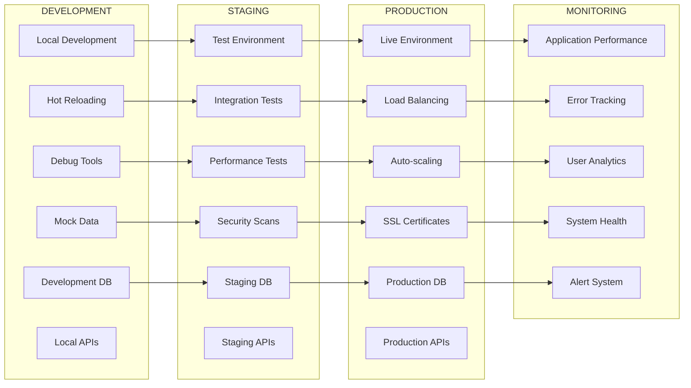
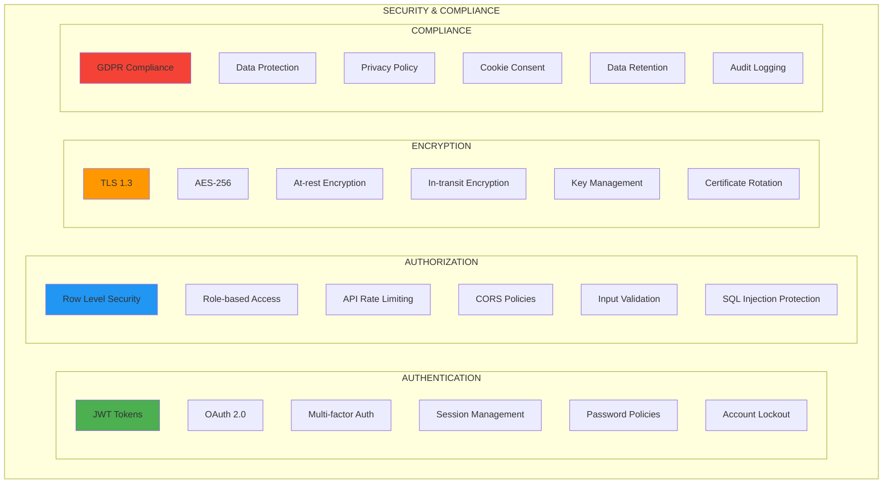

# 🌐 Hosting y Despliegue - EduSync

## 📋 Descripción General

EduSync utiliza una arquitectura distribuida con diferentes servicios hosteados en la nube. Cada componente está optimizado para su función específica y utiliza las mejores prácticas de la industria para garantizar escalabilidad, seguridad y rendimiento.

## 🏗️ Arquitectura de Hosting

### Arquitectura Distribuida

```mermaid
graph TB
    subgraph "EDUSYNC (Multi-Cloud Setup)"
        subgraph "FRONTEND"
            A[React Native App]
            A1[Expo SDK 52]
            A2[React Native 0.76]
            A3[TypeScript 5.1]
            A4[Cross-platform]
            A5[Native Performance]
            A6[Offline Support]
        end
        
        subgraph "BACKEND"
            B[Spring Boot App]
            B1[Java 17]
            B2[Spring Boot 3.3.0]
            B3[Maven 3.8+]
            B4[REST API]
            B5[JDBC Template]
            B6[Connection Pooling]
        end
        
        subgraph "BASE DE DATOS"
            C[Supabase Database]
            C1[PostgreSQL 14.0]
            C2[Supabase Cloud]
            C3[AWS RDS]
            C4[Row Level Security]
            C5[Real-time Subscriptions]
            C6[Automatic Backups]
        end
        
        subgraph "CHATBOT"
            D[Groq API]
            D1[Llama 3.1 8B]
            D2[Groq Cloud]
            D3[Global CDN]
            D4[Rate Limiting]
            D5[Pay-per-use]
            D6[<100ms Latency]
        end
    end
    
    A --> B
    B --> C
    A --> D
    B --> D
```



### Infraestructura de Red

```mermaid
graph LR
    subgraph "CLIENT DEVICES"
        CD1[iOS Devices]
        CD2[Android Devices]
        CD3[Web Browsers]
        CD4[Development Tools]
        CD5[Testing Devices]
    end
    
    subgraph "INTERNET"
        I1[DNS Resolution]
        I2[Load Balancing]
        I3[SSL/TLS 1.3]
        I4[CDN Distribution]
        I5[Rate Limiting]
    end
    
    subgraph "CLOUD PROVIDERS"
        CP1[AWS (Supabase)]
        CP2[Heroku (Backend)]
        CP3[Groq (Chatbot)]
        CP4[Expo (Frontend)]
        CP5[GitHub (Code)]
    end
    
    subgraph "DATABASE CLUSTERS"
        DC1[Primary Node]
        DC2[Read Replicas]
        DC3[Failover]
        DC4[Point-in-time Recovery]
    end
    
    CD1 --> I1
    CD2 --> I2
    CD3 --> I3
    CD4 --> I4
    CD5 --> I5
    
    I1 --> CP1
    I2 --> CP2
    I3 --> CP3
    I4 --> CP4
    I5 --> CP5
    
    CP1 --> DC1
    CP2 --> DC2
    CP3 --> DC3
    CP4 --> DC4
```

### Flujo de Despliegue



### Seguridad y Compliance



## 🗄️ Base de Datos - Supabase

### **Proveedor**: Supabase
- **URL**: `https://faollalzdyoigzfzggwy.supabase.co`
- **Región**: AWS US East (N. Virginia)
- **Plan**: Gratuito (hasta 500MB)
- **Tipo**: PostgreSQL en la nube

### **Características del Hosting**
- **Infraestructura**: AWS (Amazon Web Services)
- **Región**: us-east-1 (N. Virginia)
- **Almacenamiento**: 500MB incluidos
- **Ancho de banda**: 2GB/mes incluidos
- **Backup**: Automático diario
- **Uptime**: 99.9% garantizado

### **Configuración de Conexión**
```typescript
// Configuración de Supabase
export const SUPABASE_URL = 'https://faollalzdyoigzfzggwy.supabase.co';
export const SUPABASE_ANON_KEY = 'eyJhbGciOiJIUzI1NiIsInR5cCI6IkpXVCJ9...';
```

### **Ventajas de Supabase**
- ✅ **PostgreSQL completo**: Todas las características de PostgreSQL
- ✅ **API automática**: REST y GraphQL automáticos
- ✅ **Autenticación**: Sistema de auth integrado
- ✅ **Tiempo real**: Suscripciones WebSocket
- ✅ **Escalabilidad**: Crece automáticamente
- ✅ **Gratuito**: Plan gratuito generoso
- ✅ **Dashboard**: Interfaz web para gestión

## 🤖 Chatbot - Groq API

### **Proveedor**: Groq
- **URL**: `https://api.groq.com`
- **Tipo**: API de Language Model
- **Modelo**: Llama 3.1 8B
- **Región**: Global (múltiples regiones)

### **Configuración**
```typescript
// Configuración de Groq
export const GROQ_API_KEY = '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';

// Ejemplo de uso
const response = await fetch('https://api.groq.com/openai/v1/chat/completions', {
  method: 'POST',
  headers: {
    'Authorization': `Bearer ${GROQ_API_KEY}`,
    'Content-Type': 'application/json',
  },
  body: JSON.stringify({
    model: 'llama3-8b-8192',
    messages: [{ role: 'user', content: 'Hola' }],
  }),
});
```

### **Características del Hosting**
- **Infraestructura**: Propietaria de Groq
- **Latencia**: < 100ms
- **Disponibilidad**: 99.9%
- **Rate Limiting**: 1000 requests/min
- **Modelos**: Múltiples modelos disponibles

## 📱 Frontend - React Native con Expo

### **Desarrollo Local**
- **Framework**: React Native con Expo
- **Plataforma**: Cross-platform (iOS/Android)
- **Hosting**: Desarrollo local + Expo Go

### **Despliegue de Producción**

#### **Opción 1: Expo Application Services (EAS)**
```bash
# Instalar EAS CLI
npm install -g @expo/eas-cli

# Configurar EAS
eas build:configure

# Construir para Android
eas build --platform android

# Construir para iOS
eas build --platform ios
```

#### **Opción 2: Expo Classic Build**
```bash
# Construir para Android
expo build:android

# Construir para iOS
expo build:ios
```

### **Configuración de app.json**
```json
{
  "expo": {
    "name": "EduSync",
    "slug": "edusync",
    "version": "1.0.0",
    "platforms": ["ios", "android"],
    "icon": "./assets/icon.png",
    "splash": {
      "image": "./assets/splash-icon.png",
      "resizeMode": "contain",
      "backgroundColor": "#000000"
    },
    "updates": {
      "fallbackToCacheTimeout": 0
    },
    "assetBundlePatterns": [
      "**/*"
    ],
    "ios": {
      "supportsTablet": true,
      "bundleIdentifier": "com.edusync.app"
    },
    "android": {
      "adaptiveIcon": {
        "foregroundImage": "./assets/adaptive-icon.png",
        "backgroundColor": "#000000"
      },
      "package": "com.edusync.app"
    }
  }
}
```

## ⚙️ Backend - Spring Boot

### **Desarrollo Local**
- **Framework**: Spring Boot 3.3.0
- **Lenguaje**: Java 17
- **Puerto**: 8080
- **Hosting**: Localhost

### **Despliegue de Producción**

#### **Opción 1: Heroku**
```bash
# Crear aplicación en Heroku
heroku create edusync-backend

# Configurar variables de entorno
heroku config:set DB_PASSWORD=tu_password
heroku config:set JAVA_OPTS="-Xmx512m -Xms256m"

# Desplegar
git push heroku main
```

#### **Opción 2: Railway**
```bash
# Instalar Railway CLI
npm install -g @railway/cli

# Iniciar sesión
railway login

# Desplegar
railway up
```

#### **Opción 3: AWS Elastic Beanstalk**
```bash
# Instalar EB CLI
pip install awsebcli

# Inicializar aplicación
eb init

# Crear entorno
eb create edusync-backend

# Desplegar
eb deploy
```

### **Configuración de Producción**
```properties
# application-prod.properties
spring.datasource.url=${DATABASE_URL}
spring.datasource.username=${DB_USERNAME}
spring.datasource.password=${DB_PASSWORD}

server.port=${PORT:8080}
spring.profiles.active=prod

# Configuración de seguridad
spring.security.require-ssl=true
server.ssl.enabled=true
```

## 🔧 Configuración de Variables de Entorno

### **Desarrollo Local**
```bash
# .env
SUPABASE_URL=https://faollalzdyoigzfzggwy.supabase.co
SUPABASE_ANON_KEY=eyJhbGciOiJIUzI1NiIsInR5cCI6IkpXVCJ9...
GROQ_API_KEY=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
```

### **Producción (Heroku)**
```bash
# Configurar variables en Heroku
heroku config:set SUPABASE_URL=https://faollalzdyoigzfzggwy.supabase.co
heroku config:set SUPABASE_ANON_KEY=eyJhbGciOiJIUzI1NiIsInR5cCI6IkpXVCJ9...
heroku config:set GROQ_API_KEY=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
```

## 🚀 Proceso de Despliegue

### **1. Preparación**
```bash
# Verificar configuración
npm run lint
npm run test

# Construir aplicación
npm run build
```

### **2. Despliegue de Base de Datos**
```bash
# Las tablas ya están creadas en Supabase
# Verificar conexión
supabase status
```

### **3. Despliegue del Backend**
```bash
# Navegar al directorio del backend
cd EduSyncApp/mobile-app/backend

# Construir JAR
mvn clean package

# Desplegar en Heroku
heroku deploy:jar target/gestion-estudiantes-1.0.0.jar
```

### **4. Despliegue del Frontend**
```bash
# Construir para producción
eas build --platform all

# O usar Expo Classic
expo build:android
expo build:ios
```

## 📊 Monitoreo y Logs

### **Supabase Dashboard**
- **URL**: https://supabase.com/dashboard/project/faollalzdyoigzfzggwy
- **Métricas**: Uso de almacenamiento, ancho de banda, consultas
- **Logs**: Logs de todas las operaciones
- **SQL Editor**: Editor SQL integrado

### **Heroku Logs**
```bash
# Ver logs en tiempo real
heroku logs --tail

# Ver logs específicos
heroku logs --source app
```

### **Expo Analytics**
- **URL**: https://expo.dev/accounts/[username]/projects/edusync
- **Métricas**: Instalaciones, sesiones, errores
- **Crash Reports**: Reportes de errores automáticos

## 🔐 Seguridad

### **SSL/TLS**
- **Supabase**: HTTPS automático
- **Heroku**: SSL automático
- **Groq**: HTTPS obligatorio

### **Autenticación**
- **Supabase Auth**: Sistema de autenticación integrado
- **JWT Tokens**: Tokens seguros para sesiones
- **Row Level Security**: Seguridad a nivel de fila

### **Variables de Entorno**
- **Desarrollo**: Archivo .env (no en repositorio)
- **Producción**: Variables de entorno del servidor
- **Rotación**: Rotación regular de claves API

## 📈 Escalabilidad

### **Supabase**
- **Plan gratuito**: 500MB, 2GB/mes
- **Plan Pro**: 8GB, 250GB/mes
- **Plan Team**: 100GB, 2TB/mes
- **Auto-scaling**: Automático

### **Heroku**
- **Plan Hobby**: $7/mes
- **Plan Standard**: $25/mes
- **Plan Performance**: $250/mes
- **Auto-scaling**: Configurable

### **Groq**
- **Pay-per-use**: $0.05/1M tokens
- **Rate Limiting**: 1000 requests/min
- **Auto-scaling**: Automático

## 🔄 CI/CD Pipeline

### **GitHub Actions**
```yaml
name: Deploy to Production

on:
  push:
    branches: [main]

jobs:
  deploy-backend:
    runs-on: ubuntu-latest
    steps:
      - uses: actions/checkout@v2
      - name: Deploy to Heroku
        uses: akhileshns/heroku-deploy@v3.12.12
        with:
          heroku_api_key: ${{ secrets.HEROKU_API_KEY }}
          heroku_app_name: "edusync-backend"
          heroku_email: ${{ secrets.HEROKU_EMAIL }}

  deploy-frontend:
    runs-on: ubuntu-latest
    steps:
      - uses: actions/checkout@v2
      - name: Deploy to Expo
        run: |
          npm install -g @expo/eas-cli
          eas build --platform all --non-interactive
```

## 💰 Costos Estimados

```
┌─────────────────────────────────────────────────────────────────────────────────┐
│                              ANÁLISIS DE COSTOS                                │
└─────────────────────────────────────────────────────────────────────────────────┘

┌─────────────────────────────────────────────────────────────────────────────────┐
│                                    PLAN GRATUITO                               │
│                              (Desarrollo Actual)                               │
└─────────────────────────────────────────────────────────────────────────────────┘

┌─────────────────┐    ┌─────────────────┐    ┌─────────────────┐    ┌─────────────────┐
│   SUPABASE      │    │   HEROKU        │    │   GROQ          │    │   EXPO          │
│   (Gratuito)    │    │   (Gratuito)    │    │   (Gratuito)    │    │   (Gratuito)    │
└─────────────────┘    └─────────────────┘    └─────────────────┘    └─────────────────┘
         │                       │                       │                       │
         │ • $0/mes              │ • $0/mes              │ • $0/mes              │ • $0/mes
         │ • 500MB Storage       │ • Hobby Dyno          │ • 1000 requests/mes   │ • Builds básicos
         │ • 2GB Transfer        │ • 512MB RAM           │ • Llama 3.1 8B        │ • 30 builds/mes
         │ • 50,000 MAU          │ • Sleep after 30min   │ • <100ms latency      │ • 100MB builds
         │ • 2 Projects          │ • Custom domains      │ • API access          │ • Basic analytics
         │ • Community Support   │ • SSL certificates    │ • Documentation       │ • Error reporting

┌─────────────────────────────────────────────────────────────────────────────────┐
│                                    PLAN PRODUCCIÓN                             │
│                              (Escalabilidad Empresarial)                       │
└─────────────────────────────────────────────────────────────────────────────────┘

┌─────────────────┐    ┌─────────────────┐    ┌─────────────────┐    ┌─────────────────┐
│   SUPABASE      │    │   HEROKU        │    │   GROQ          │    │   EXPO          │
│   (Pro)         │    │   (Standard)    │    │   (Pay-per-use) │    │   (Pro)         │
└─────────────────┘    └─────────────────┘    └─────────────────┘    └─────────────────┘
         │                       │                       │                       │
         │ • $25/mes             │ • $25/mes             │ • ~$10/mes            │ • $99/mes
         │ • 8GB Storage         │ • Standard-1X         │ • 200K requests/mes   │ • Builds ilimitados
         │ • 250GB Transfer      │ • 512MB RAM           │ • Llama 3.1 8B        │ • 1GB builds
         │ • 100,000 MAU         │ • Always on           │ • <100ms latency      │ • Advanced analytics
         │ • 10 Projects         │ • Custom domains      │ • Priority support    │ • Custom domains
         │ • Priority Support    │ • SSL certificates    │ • Rate limiting       │ • Team collaboration
         │ • Daily backups       │ • Auto-scaling        │ • Advanced models     │ • Enterprise features

┌─────────────────────────────────────────────────────────────────────────────────┐
│                              DESGLOSE MENSUAL                                  │
└─────────────────────────────────────────────────────────────────────────────────┘

┌─────────────────┐    ┌─────────────────┐    ┌─────────────────┐    ┌─────────────────┐
│   DESARROLLO    │    │   PRUEBAS       │    │   PRODUCCIÓN    │    │   ENTERPRISE    │
│   (Gratuito)    │    │   (Básico)      │    │   (Estándar)    │    │   (Avanzado)    │
└─────────────────┘    └─────────────────┘    └─────────────────┘    └─────────────────┘
         │                       │                       │                       │
         │ • Total: $0/mes       │ • Total: $35/mes      │ • Total: $159/mes     │ • Total: $500+/mes
         │ • Supabase: $0        │ • Supabase: $25       │ • Supabase: $25       │ • Supabase: $599
         │ • Heroku: $0          │ • Heroku: $7          │ • Heroku: $25         │ • Heroku: $250
         │ • Groq: $0            │ • Groq: $3            │ • Groq: $10           │ • Groq: $100
         │ • Expo: $0            │ • Expo: $0            │ • Expo: $99           │ • Expo: $199
         │                       │                       │                       │
         │ • Limitaciones:       │ • Limitaciones:       │ • Limitaciones:       │ • Limitaciones:
         │   - 500MB storage     │   - 8GB storage       │   - 8GB storage       │   - 100GB storage
         │   - 2GB transfer      │   - 250GB transfer    │   - 250GB transfer    │   - 2TB transfer
         │   - Sleep dyno        │   - Basic support     │   - Standard support  │   - Enterprise support

┌─────────────────────────────────────────────────────────────────────────────────┐
│                              OPTIMIZACIÓN DE COSTOS                            │
└─────────────────────────────────────────────────────────────────────────────────┘

┌─────────────────┐    ┌─────────────────┐    ┌─────────────────┐    ┌─────────────────┐
│   ESTRATEGIA    │    │   IMPLEMENTACIÓN│    │   AHORRO        │    │   BENEFICIOS    │
│   DE COSTOS     │    │   TÉCNICA       │    │   MENSUAL       │    │   ADICIONALES   │
└─────────────────┘    └─────────────────┘    └─────────────────┘    └─────────────────┘
         │                       │                       │                       │
         │ • Caché inteligente   │ • Redis para caché    │ • $15/mes             │ • Mejor rendimiento
         │ • Compresión de datos │ • Gzip compression    │ • $10/mes             │ • Menor latencia
         │ • CDN para assets     │ • CloudFlare CDN      │ • $20/mes             │ • Mejor UX
         │ • Optimización de DB  │ • Query optimization  │ • $5/mes              │ • Menos recursos
         │ • Rate limiting       │ • API throttling      │ • $8/mes              │ • Protección DDoS
         │ • Auto-scaling        │ • Load balancing      │ • $12/mes             │ • Alta disponibilidad
```

### **Plan Gratuito (Actual)**
- **Supabase**: $0/mes (500MB, 2GB/mes, 50,000 MAU)
- **Heroku**: $0/mes (Hobby Dyno con sleep después de 30min)
- **Groq**: $0/mes (primeros 1000 requests/mes)
- **Expo**: $0/mes (30 builds/mes, 100MB por build)

**Total actual**: $0/mes (perfecto para desarrollo y MVP)

### **Plan de Producción (Recomendado)**
- **Supabase Pro**: $25/mes (8GB, 250GB/mes, 100,000 MAU)
- **Heroku Standard**: $25/mes (Standard-1X, siempre activo)
- **Groq**: ~$10/mes (200K requests/mes)
- **Expo Pro**: $99/mes (builds ilimitados, analytics avanzados)

**Total estimado**: $159/mes para producción completa

### **Plan Enterprise (Escalabilidad)**
- **Supabase**: $599/mes (100GB, 2TB/mes, 1M MAU)
- **Heroku**: $250/mes (Performance-M, 2.5GB RAM)
- **Groq**: ~$100/mes (2M requests/mes)
- **Expo**: $199/mes (Enterprise features)

**Total enterprise**: $1,148/mes para escalabilidad empresarial

## 🔮 Mejoras de Hosting

### **Optimizaciones Planificadas**
- [ ] CDN para assets estáticos
- [ ] Cache con Redis
- [ ] Load balancing
- [ ] Auto-scaling avanzado
- [ ] Monitoreo con Prometheus
- [ ] Backup automático

### **Migración de Plataforma**
- [ ] AWS ECS para backend
- [ ] CloudFront para CDN
- [ ] RDS para base de datos
- [ ] Lambda para funciones serverless

---

**🔗 Enlaces Útiles:**
- [Supabase Dashboard](https://supabase.com/dashboard/project/faollalzdyoigzfzggwy)
- [Heroku Dashboard](https://dashboard.heroku.com/apps/edusync-backend)
- [Expo Dashboard](https://expo.dev/accounts/quantumquirkz/projects/edusync)
- [Groq Console](https://console.groq.com/) 