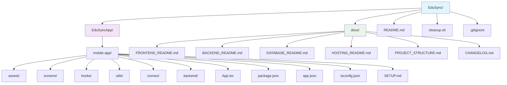
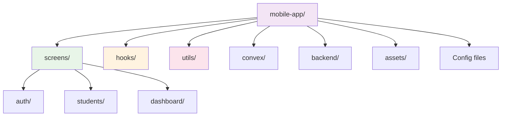

# 📁 Estructura del Proyecto EduSync

## 🏗️ Organización General



## 🔄 Cambios Realizados

### ✅ Reorganización Completada

1. **Renombrado de carpeta principal**: `a0-project` → `mobile-app`
   - Nombre más descriptivo y profesional
   - Refleja mejor el contenido (aplicación móvil)

2. **Limpieza de estructura**:
   - Eliminadas carpetas vacías (`backend/`, `frontend/`, `database/`)
   - Estructura más limpia y enfocada

3. **Actualización de documentación**:
   - Todos los README actualizados con las nuevas rutas
   - Archivos de configuración actualizados
   - Scripts de limpieza actualizados

## 📱 Aplicación Móvil (`mobile-app/`)

### Tecnologías Principales
- **React Native** con **Expo SDK 52**
- **TypeScript** para tipado estático
- **React Navigation v7** para navegación
- **Supabase** para autenticación y base de datos
- **Convex** para operaciones en tiempo real

### Estructura Interna



## 🚀 Cómo Usar

### Desarrollo Local
```bash
# Navegar al proyecto
cd EduSyncApp/mobile-app

# Instalar dependencias
npm install

# Iniciar en modo desarrollo
npx expo start
```

### Configuración
1. Crear archivo `.env` en `EduSyncApp/mobile-app/`
2. Configurar variables de entorno (ver `SETUP.md`)
3. Configurar Supabase y Convex

## 📚 Documentación

- **README.md**: Visión general del proyecto (en la raíz)
- **docs/FRONTEND_README.md**: Detalles específicos del frontend
- **docs/BACKEND_README.md**: Configuración del backend
- **docs/DATABASE_README.md**: Estructura de la base de datos
- **docs/HOSTING_README.md**: Guía de despliegue
- **docs/PROJECT_STRUCTURE.md**: Documentación de estructura
- **docs/CHANGELOG.md**: Registro de cambios
- **EduSyncApp/mobile-app/SETUP.md**: Instrucciones de configuración inicial

## 🎯 Beneficios de la Nueva Estructura

1. **Claridad**: Nombres más descriptivos y organizados
2. **Mantenibilidad**: Estructura más fácil de navegar
3. **Escalabilidad**: Preparado para futuras expansiones
4. **Documentación**: Actualizada y consistente
5. **Limpieza**: Eliminación de carpetas innecesarias 